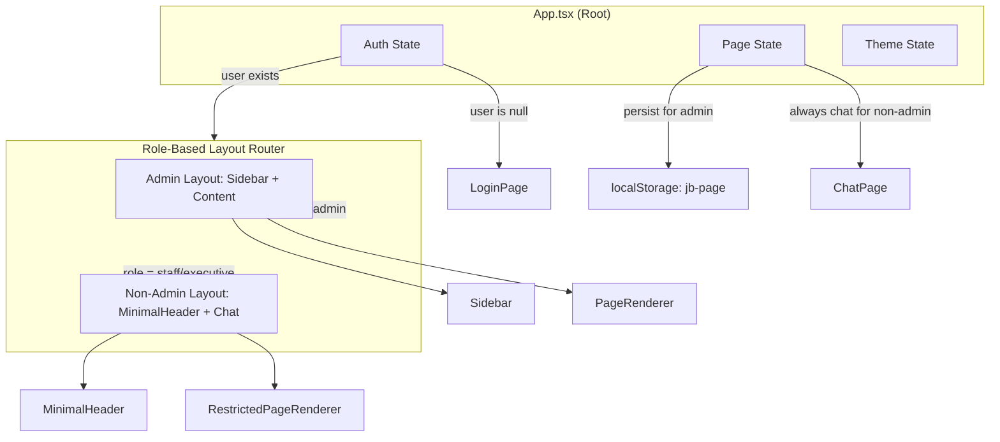

# Design Document: Frontend Redesign

## Overview

This design restructures the JB Executive Copilot frontend to make the Chat page the default landing experience and to conditionally render navigation based on user role. The core changes are:

1. **Chat as default page** — All users land on Chat after login instead of Dashboard.
2. **Role-based sidebar visibility** — Only admin users see the full sidebar navigation; non-admin users (staff, executive) get a minimal header with essential controls.
3. **Floating action button removal** — The redundant FAB for navigating to chat is eliminated.
4. **Page access restrictions** — Non-admin users can only access a subset of pages based on their role.
5. **Session persistence** — Admin users' last visited page is persisted and restored; non-admin users always restore to Chat.

The redesign targets the existing React SPA architecture (Vite + React 18 + Tailwind CSS + Radix UI) and modifies `App.tsx`, `Sidebar.tsx`, and introduces a new `MinimalHeader` component.

## Architecture



### Layout Strategy

- **Admin layout**: Traditional sidebar + content area. Sidebar is a fixed-width panel on the left (`w-56` default, collapsible to `w-16`). Content occupies remaining space via `flex-1`.
- **Non-admin layout**: Full-width content with a sticky `MinimalHeader` bar at the top. No sidebar DOM element is rendered. Chat page uses `100vw` minus any padding.
- **Chat page for admin**: Rendered within the sidebar layout (not full-screen bypass). The existing full-screen chat path (`if (page === "chat")`) is removed for admin users.

## Components and Interfaces

### Modified Components

#### `App.tsx`

**Changes:**
- Default `page` state initializes to `"chat"` instead of `"dashboard"`.
- On login callback, sets page to `"chat"` instead of `"dashboard"`.
- Adds role-based layout branching: admin renders `Sidebar` + content; non-admin renders `MinimalHeader` + restricted content.
- Removes the floating action button (`motion.button` with `MessageSquare`).
- Removes the full-screen chat bypass (`if (page === "chat")` block).
- Adds page persistence to `localStorage` under key `"jb-page"` for admin users.
- On session restore: admin reads `"jb-page"` and validates against allowed page list; non-admin always sets page to `"chat"`.
- Adds page access enforcement: validates page against role-allowed set, redirects to `"chat"` on violation.

```typescript
// New page permission map
const PAGE_PERMISSIONS: Record<string, string[]> = {
  staff: ["chat", "settings"],
  executive: ["chat", "settings", "departments"],
  admin: [
    "dashboard", "chat", "knowledge", "users", "departments",
    "settings", "explorer", "graph", "search", "ingestion", "monitoring"
  ],
};

// Valid page identifiers for persistence
const VALID_PAGES = [
  "dashboard", "chat", "knowledge", "users", "departments",
  "settings", "explorer", "graph", "search", "ingestion", "monitoring"
] as const;
```

#### `Sidebar.tsx`

**Changes:**
- Adds a `"chat"` navigation item to the `"Utama"` group as the **first item**, with `roles: ["admin"]`.
- The chat item uses a `MessageSquare` (or equivalent) icon.

```typescript
// Updated NAV_GROUPS[0] (Utama)
{
  label: "Utama",
  items: [
    { id: "chat", label: "Chat", icon: MessageSquare, roles: ["admin"] },
    { id: "dashboard", label: "Dashboard", icon: LayoutDashboard, roles: ["admin"] },
    { id: "search", label: "Search", icon: Search, roles: ["admin"] },
  ],
}
```

### New Components

#### `MinimalHeader.tsx`

A lightweight top bar for non-admin users providing logout, theme toggle, and user identity display.

```typescript
interface MinimalHeaderProps {
  user: UserProfile;
  theme: "dark" | "light";
  onToggleTheme: () => void;
  onLogout: () => void;
}
```

**Visual structure:**
- Fixed/sticky at top of viewport (`position: sticky; top: 0; z-index: 30`).
- Height: `h-14` (56px).
- Left side: App logo/title.
- Right side: User name (text) + circular avatar + theme toggle button + logout button.
- Background matches app background with a subtle bottom border (`border-b border-border`).
- Does not scroll with page content.

### Helper Functions

#### `getPermittedPages(role: string): string[]`

Returns the list of page identifiers accessible to a given role.

#### `isPagePermitted(role: string, page: string): boolean`

Returns whether a specific page is accessible for the given role.

#### `getInitialPage(user: UserProfile): string`

Determines the initial page on session restore:
- Non-admin: always returns `"chat"`.
- Admin: reads `"jb-page"` from localStorage, validates it against `VALID_PAGES`, returns the stored value if valid or `"chat"` if invalid/missing.

## Data Models

### UserProfile (unchanged)

```typescript
interface UserProfile {
  name: string;
  role: "staff" | "executive" | "admin";
  department: string;
  avatar: string;
}
```

### Page State

```typescript
type PageId = 
  | "dashboard" | "chat" | "knowledge" | "users" | "departments"
  | "settings" | "explorer" | "graph" | "search" | "ingestion" | "monitoring";
```

### localStorage Schema

| Key | Type | Description |
|-----|------|-------------|
| `jb-user` | `JSON(UserProfile)` | Persisted user session |
| `jb-theme` | `"dark" \| "light"` | Theme preference |
| `jb-page` | `PageId` | Last visited page (admin only) |

### Role-Permission Matrix

| Page | staff | executive | admin |
|------|-------|-----------|-------|
| chat | ✓ | ✓ | ✓ |
| settings | ✓ | ✓ | ✓ |
| departments | ✗ | ✓ | ✓ |
| dashboard | ✗ | ✗ | ✓ |
| knowledge | ✗ | ✗ | ✓ |
| users | ✗ | ✗ | ✓ |
| explorer | ✗ | ✗ | ✓ |
| graph | ✗ | ✗ | ✓ |
| search | ✗ | ✗ | ✓ |
| ingestion | ✗ | ✗ | ✓ |
| monitoring | ✗ | ✗ | ✓ |


## Correctness Properties

*A property is a characteristic or behavior that should hold true across all valid executions of a system—essentially, a formal statement about what the system should do. Properties serve as the bridge between human-readable specifications and machine-verifiable correctness guarantees.*

### Property 1: Default page after login is always Chat

*For any* valid UserProfile (with role in {"staff", "executive", "admin"}), after successful authentication the page state SHALL be set to "chat".

**Validates: Requirements 1.1**

### Property 2: Corrupt session data results in unauthenticated state

*For any* string stored in localStorage under "jb-user" that is not valid JSON or does not conform to the UserProfile schema (missing required fields or invalid role), the initial user state SHALL be null (resulting in Login page display).

**Validates: Requirements 1.3**

### Property 3: Non-admin layout renders MinimalHeader without Sidebar

*For any* authenticated user with role "staff" or "executive", the rendered layout SHALL include the MinimalHeader component and SHALL NOT include the Sidebar component.

**Validates: Requirements 3.1, 4.1**

### Property 4: Page permission enforcement

*For any* role R and page identifier P, if P is not in the permitted pages set for R, then attempting to set page to P SHALL result in the page state being "chat". Conversely, if P is in the permitted set for R, the page state SHALL be P.

**Validates: Requirements 5.1, 5.2, 5.3**

### Property 5: Non-admin session restore always yields Chat

*For any* non-admin user (role "staff" or "executive") restored from localStorage, regardless of what value exists in "jb-page" (valid page, invalid page, empty, or missing), the initial page state SHALL be "chat".

**Validates: Requirements 1.2, 5.4, 8.4**

### Property 6: Admin page persistence round-trip

*For any* admin user and any valid page identifier P from the admin's permitted set, navigating to P persists P to localStorage "jb-page", and subsequently restoring an admin session SHALL set page state to P.

**Validates: Requirements 8.1, 8.2**

### Property 7: Admin invalid page restore defaults to Chat

*For any* string value V stored in "jb-page" that is NOT a valid page identifier (not in the VALID_PAGES set), restoring an admin session SHALL set page state to "chat".

**Validates: Requirements 8.3**

### Property 8: No floating action button for any authenticated user

*For any* authenticated user (any role) on any page, the rendered DOM SHALL NOT contain a floating action button element for chat navigation.

**Validates: Requirements 7.1**

### Property 9: Theme toggle persistence round-trip

*For any* initial theme value T in {"dark", "light"}, invoking the toggle function SHALL set the theme to the opposite value and persist it to localStorage "jb-theme". Reading "jb-theme" from localStorage SHALL return the new value.

**Validates: Requirements 4.3**

### Property 10: MinimalHeader displays user identity

*For any* UserProfile with non-empty name and avatar fields, the MinimalHeader SHALL render text content containing the user's name and an element representing the user's avatar.

**Validates: Requirements 4.4**

## Error Handling

### Invalid localStorage Data

| Scenario | Handling |
|----------|----------|
| `jb-user` is unparseable JSON | Discard entry, set user to null, show LoginPage |
| `jb-user` parses but lacks required fields | Discard entry, set user to null, show LoginPage |
| `jb-page` contains invalid page identifier | Ignore value, default to "chat" |
| `jb-page` is missing or empty | Default to "chat" |
| `jb-theme` has unexpected value | Default to "dark" |

### Role Change During Session

If the user's role changes (e.g., via an admin action reflected in a re-fetched profile):
- The App re-evaluates layout based on new role.
- If downgraded from admin to non-admin, sidebar is removed and page is forced to "chat" if the current page is not in the new role's permitted set.
- localStorage "jb-page" is cleared on downgrade since non-admin users don't use page persistence.

### Navigation to Invalid Pages

Any `setPage(id)` call is guarded by a permission check:
- If `id` is not in the user's permitted set, the call is intercepted and page is set to "chat" instead.
- This covers both programmatic navigation and any edge case where localStorage is manually tampered with.

## Testing Strategy

### Property-Based Testing

This feature is suitable for property-based testing because the core logic (page permissions, session restore, page persistence) involves pure functions with clear input/output behavior and a wide input space (arbitrary strings for localStorage values, different role/page combinations).

**Library:** [fast-check](https://github.com/dubzzz/fast-check) (JavaScript/TypeScript PBT library)

**Configuration:**
- Minimum 100 iterations per property test
- Each property test references its design document property
- Tag format: `Feature: frontend-redesign, Property {number}: {property_text}`

**Properties to implement as PBT:**
- Property 2 (corrupt session): Generate arbitrary strings and invalid JSON, verify user state is null
- Property 4 (page permissions): Generate random (role, page) pairs, verify enforcement
- Property 5 (non-admin session restore): Generate random non-admin users and random jb-page values, verify always "chat"
- Property 6 (admin page round-trip): Generate random valid pages, verify persist/restore cycle
- Property 7 (admin invalid page restore): Generate random invalid page strings, verify default to "chat"
- Property 9 (theme toggle round-trip): Generate random initial themes, verify toggle behavior

### Unit Tests (Example-Based)

Unit tests cover specific scenarios, integration points, and rendering behavior:

- **Login flow**: Admin login renders Sidebar + Chat; staff login renders MinimalHeader + Chat
- **Sidebar navigation groups**: Admin sees all 3 groups with Chat as first item in Utama
- **MinimalHeader rendering**: Contains logout button, theme toggle, user name, avatar
- **Logout behavior**: Clears localStorage ("jb-user", "jb-page"), resets user state
- **Role change reactivity**: Switching role from admin to staff removes sidebar, adds MinimalHeader
- **FAB removal**: No floating button in any authenticated view
- **Active nav indicator**: Chat nav item shows active styling when page is "chat" for admin

### Integration Tests

- **Full login → session restore cycle**: Login as admin, navigate to "settings", reload, verify "settings" is restored
- **Full login → non-admin cycle**: Login as staff, verify only Chat and Settings pages accessible
- **Theme persistence across reload**: Toggle theme, reload, verify correct theme applied

### Test File Organization

```
frontend/src/__tests__/
├── properties/
│   ├── pagePermissions.property.test.ts
│   ├── sessionRestore.property.test.ts
│   ├── pagePersistence.property.test.ts
│   └── themeToggle.property.test.ts
├── unit/
│   ├── App.test.tsx
│   ├── MinimalHeader.test.tsx
│   └── Sidebar.test.tsx
└── integration/
    └── authFlow.test.tsx
```
