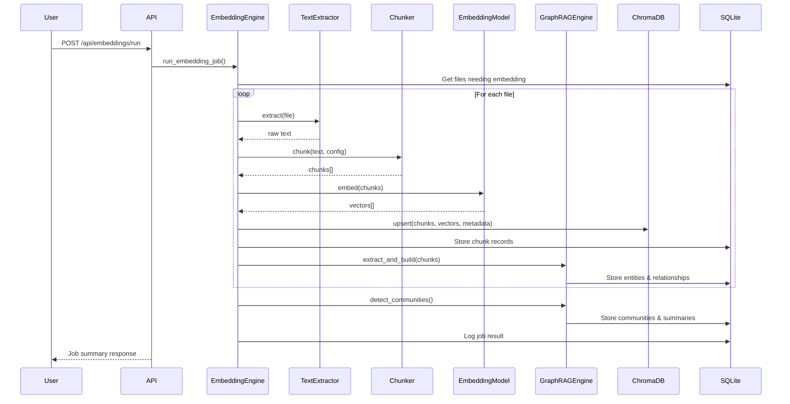

# Design Document: GraphRAG Embedding

## Overview

This design extends the existing Knowledge Base Manager backend (FastAPI + SQLAlchemy/SQLite) with a GraphRAG (Graph-based Retrieval Augmented Generation) pipeline. The system transforms indexed documents into vector embeddings, builds a semantic knowledge graph with entities and communities, and exposes retrieval endpoints for downstream LLM consumption.

The architecture follows a layered approach:
1. **Embedding Layer** — Document chunking, vector generation, and storage
2. **Graph Layer** — Entity/relationship extraction, community detection, and summarization
3. **Retrieval Layer** — Local search (vector similarity + graph neighborhood), global search (community summaries), and combined context assembly
4. **Orchestration Layer** — Job management, sync integration, and status tracking

### Key Design Decisions

| Decision | Choice | Rationale |
|----------|--------|-----------|
| Vector storage | ChromaDB (local persistent) | Lightweight, no server needed, Python-native, supports metadata filtering |
| Embedding model | sentence-transformers (all-MiniLM-L6-v2) | Runs locally, no API costs, 384-dim vectors, good quality/speed tradeoff |
| Community detection | Leiden algorithm via `leidenalg` | Hierarchical, resolution-parameterized, well-suited for knowledge graphs |
| Entity extraction | Rule-based (spaCy NER) default, LLM-based optional | Rule-based is fast/free; LLM-based is higher quality but requires API access |
| Text extraction | `python-docx` for DOCX, built-in for MD/TXT/JSON | Minimal dependencies, covers the required formats |
| Graph library | `networkx` | Already standard for Python graph operations, supports community detection integration |

## Architecture

```mermaid
graph TB
    subgraph API Layer
        EP_EMBED[POST /api/embeddings/run]
        EP_EMBED_FILE[POST /api/embeddings/run/{file_id}]
        EP_EMBED_FULL[POST /api/embeddings/run/full]
        EP_STATUS[GET /api/embeddings/status]
        EP_LOCAL[POST /api/search/local]
        EP_GLOBAL[POST /api/search/global]
        EP_COMBINED[POST /api/search/combined]
    end

    subgraph Service Layer
        EMB_ENGINE[EmbeddingEngine]
        GRAPHRAG[GraphRAGEngine]
        RETRIEVAL[RetrievalService]
    end

    subgraph Processing Pipeline
        EXTRACT[TextExtractor]
        CHUNKER[DocumentChunker]
        EMBEDDER[EmbeddingModel]
        ENTITY_EX[EntityExtractor]
        REL_EX[RelationshipExtractor]
        COMMUNITY[CommunityDetector]
        SUMMARIZER[CommunitySummarizer]
    end

    subgraph Storage Layer
        SQLITE[(SQLite - Metadata)]
        CHROMA[(ChromaDB - Vectors)]
    end

    EP_EMBED --> EMB_ENGINE
    EP_EMBED_FILE --> EMB_ENGINE
    EP_EMBED_FULL --> EMB_ENGINE
    EP_STATUS --> EMB_ENGINE
    EP_LOCAL --> RETRIEVAL
    EP_GLOBAL --> RETRIEVAL
    EP_COMBINED --> RETRIEVAL

    EMB_ENGINE --> EXTRACT
    EMB_ENGINE --> CHUNKER
    EMB_ENGINE --> EMBEDDER
    EMB_ENGINE --> GRAPHRAG

    GRAPHRAG --> ENTITY_EX
    GRAPHRAG --> REL_EX
    GRAPHRAG --> COMMUNITY
    GRAPHRAG --> SUMMARIZER

    RETRIEVAL --> CHROMA
    RETRIEVAL --> SQLITE
    RETRIEVAL --> GRAPHRAG

    EMB_ENGINE --> SQLITE
    EMB_ENGINE --> CHROMA
    GRAPHRAG --> SQLITE
```

### Processing Flow



## Components and Interfaces

### 1. TextExtractor

Responsible for extracting plain text from supported file formats.

```python
class TextExtractor:
    """Extracts text content from files based on their format."""

    def extract(self, file_path: Path, file_format: str) -> str | None:
        """Extract text from a file. Returns None if format unsupported."""
        ...

    def _extract_plaintext(self, path: Path) -> str: ...
    def _extract_markdown(self, path: Path) -> str: ...
    def _extract_json(self, path: Path) -> str: ...
    def _extract_docx(self, path: Path) -> str: ...
```

**Supported formats:** `.txt`, `.md`, `.json`, `.docx`
**Unsupported formats:** Binary files (`.pdf`, `.png`, `.exe`, etc.) — skipped with warning.

### 2. DocumentChunker

Splits extracted text into overlapping chunks with metadata.

```python
@dataclass
class ChunkResult:
    text: str
    chunk_index: int
    start_offset: int
    end_offset: int

class DocumentChunker:
    """Splits text into overlapping chunks using token-based boundaries."""

    def __init__(self, chunk_size: int = 512, chunk_overlap: int = 50, model_name: str = "all-MiniLM-L6-v2"):
        self.chunk_size = chunk_size
        self.chunk_overlap = chunk_overlap
        self.tokenizer = self._load_tokenizer(model_name)

    def chunk(self, text: str) -> list[ChunkResult]:
        """Split text into chunks. Returns empty list for empty text."""
        ...
```

### 3. EmbeddingModel

Wrapper around the sentence-transformers model for generating embeddings.

```python
class EmbeddingModel:
    """Generates vector embeddings using sentence-transformers."""

    def __init__(self, model_name: str = "all-MiniLM-L6-v2"):
        self.model = SentenceTransformer(model_name)
        self.dimension = self.model.get_sentence_embedding_dimension()

    def embed_texts(self, texts: list[str]) -> list[list[float]]:
        """Generate embeddings for a batch of texts."""
        ...

    def embed_query(self, query: str) -> list[float]:
        """Generate embedding for a single query string."""
        ...
```

### 4. EmbeddingEngine

Orchestrates the full embedding pipeline for files.

```python
@dataclass
class EmbeddingJobResult:
    files_processed: int
    chunks_generated: int
    errors: list[dict]  # [{file_id, file_path, error}]
    status: str  # "success", "partial_success", "error"

class EmbeddingEngine:
    """Orchestrates document chunking, embedding, and graph extraction."""

    def __init__(self, db: Session, config: GraphRAGSettings):
        self.db = db
        self.config = config
        self.extractor = TextExtractor()
        self.chunker = DocumentChunker(config.chunk_size, config.chunk_overlap, config.embedding_model)
        self.model = EmbeddingModel(config.embedding_model)
        self.vector_store = ChromaVectorStore(config)
        self.graphrag = GraphRAGEngine(db, config)

    def run_incremental(self) -> EmbeddingJobResult:
        """Process files with changed content_hash or no prior embedding."""
        ...

    def run_full(self) -> EmbeddingJobResult:
        """Re-embed all indexed files regardless of hash."""
        ...

    def run_single(self, file_id: int) -> EmbeddingJobResult:
        """Embed a single file by ID."""
        ...

    def _process_file(self, file: File) -> tuple[int, list[dict]]:
        """Process one file: extract → chunk → embed → store → graph extract."""
        ...

    def _compute_document_embedding(self, chunk_embeddings: list[list[float]]) -> list[float]:
        """Average chunk embeddings to produce document-level embedding."""
        ...
```

### 5. ChromaVectorStore

Manages vector storage and similarity search via ChromaDB.

```python
class ChromaVectorStore:
    """Persistent vector store using ChromaDB."""

    def __init__(self, config: GraphRAGSettings):
        self.client = chromadb.PersistentClient(path=config.vector_store_path)
        self.collection = self.client.get_or_create_collection(
            name="kb_chunks",
            metadata={"hnsw:space": "cosine"}
        )

    def upsert_chunks(self, file_id: int, chunks: list[ChunkResult], embeddings: list[list[float]], metadata: dict) -> None:
        """Store chunk embeddings with metadata. Replaces existing for file_id."""
        ...

    def delete_by_file(self, file_id: int) -> None:
        """Remove all embeddings for a file."""
        ...

    def similarity_search(self, query_embedding: list[float], top_k: int, min_score: float, filters: dict | None = None) -> list[dict]:
        """Find top-k similar chunks above min_score threshold."""
        ...
```

### 6. EntityExtractor

Extracts named entities from text chunks.

```python
ENTITY_TYPES = {"person", "organization", "concept", "location", "event", "document"}

@dataclass
class ExtractedEntity:
    name: str
    normalized_name: str  # case-folded, whitespace-trimmed
    entity_type: str  # one of ENTITY_TYPES
    description: str
    source_chunk_id: int

class EntityExtractor:
    """Extracts entities from text using rule-based or LLM-based methods."""

    def __init__(self, method: str = "rule-based"):
        self.method = method
        if method == "rule-based":
            self._nlp = spacy.load("en_core_web_sm")

    def extract(self, chunk_text: str, chunk_id: int) -> list[ExtractedEntity]:
        """Extract up to 50 entities from a chunk."""
        ...
```

### 7. RelationshipExtractor

Identifies relationships between co-occurring entities.

```python
@dataclass
class ExtractedRelationship:
    source_entity_name: str
    target_entity_name: str
    description: str
    strength: float  # 0.0 to 1.0
    source_chunk_id: int

class RelationshipExtractor:
    """Extracts relationships between entity pairs within chunks."""

    def extract(self, entities: list[ExtractedEntity], chunk_text: str, chunk_id: int) -> list[ExtractedRelationship]:
        """Extract relationships between all entity pairs in a chunk."""
        ...
```

### 8. GraphRAGEngine

Manages the semantic knowledge graph: entities, relationships, communities.

```python
class GraphRAGEngine:
    """Builds and queries the semantic knowledge graph."""

    def __init__(self, db: Session, config: GraphRAGSettings):
        self.db = db
        self.config = config
        self.entity_extractor = EntityExtractor(config.entity_extraction_method)
        self.relationship_extractor = RelationshipExtractor()
        self.community_detector = CommunityDetector(config)

    def extract_entities_and_relationships(self, chunks: list[Chunk], file_id: int) -> None:
        """Extract entities and relationships from chunks, merge into graph."""
        ...

    def detect_communities(self) -> None:
        """Run community detection on the full entity graph."""
        ...

    def get_graph_neighborhood(self, chunk_id: int, hops: int = 1) -> dict:
        """Get entities and relationships within N hops of a chunk."""
        ...

    def _deduplicate_entities(self, entities: list[ExtractedEntity]) -> list[Entity]:
        """Merge entities with same normalized name and type."""
        ...

    def _merge_into_file_graph(self, file_id: int, entities: list[Entity], relationships: list[EntityRelationship]) -> None:
        """Add entity nodes and semantic edges without removing manual relationships."""
        ...
```

### 9. CommunityDetector

Runs hierarchical community detection and generates summaries.

```python
class CommunityDetector:
    """Detects communities in the entity graph using Leiden algorithm."""

    def __init__(self, config: GraphRAGSettings):
        self.resolution = config.community_resolution
        self.max_community_size = config.max_community_size

    def detect(self, entities: list[Entity], relationships: list[EntityRelationship]) -> list[Community]:
        """Run hierarchical community detection (2-5 levels)."""
        ...

    def generate_summary(self, community: Community, entities: list[Entity], relationships: list[EntityRelationship]) -> str:
        """Generate natural language summary for a community (≤500 tokens)."""
        ...
```

### 10. RetrievalService

Handles search queries and context assembly.

```python
@dataclass
class SearchResult:
    chunks: list[dict]
    entities: list[dict]
    relationships: list[dict]
    community_summaries: list[dict]
    source_attributions: list[dict]
    metadata: dict

class RetrievalService:
    """Handles local, global, and combined search queries."""

    def __init__(self, db: Session, config: GraphRAGSettings):
        self.db = db
        self.config = config
        self.model = EmbeddingModel(config.embedding_model)
        self.vector_store = ChromaVectorStore(config)
        self.graphrag = GraphRAGEngine(db, config)

    def local_search(self, query: str, top_k: int = 5, min_score: float = 0.5) -> SearchResult:
        """Vector similarity search enriched with graph neighborhood."""
        ...

    def global_search(self, query: str, num_communities: int = 3, min_relevance: float = 0.1) -> SearchResult:
        """Community-summary-based thematic search."""
        ...

    def combined_search(self, query: str, max_tokens: int = 4000, **kwargs) -> SearchResult:
        """Merge local and global results within token budget."""
        ...

    def _compute_combined_score(self, similarity: float, graph_relevance: float, sim_weight: float = 0.7) -> float:
        """Weighted combination of similarity and graph relevance."""
        return sim_weight * similarity + (1 - sim_weight) * graph_relevance

    def _truncate_to_token_limit(self, results: SearchResult, max_tokens: int) -> SearchResult:
        """Remove lowest-relevance items until within token budget."""
        ...

    def _normalize_graph_relevance(self, connection_count: int, max_connections: int) -> float:
        """Normalize graph connection count to 0-1 scale."""
        ...
```

## Data Models

### SQLAlchemy Models (New Tables)

```python
# app/models/chunk.py
class Chunk(Base):
    __tablename__ = "chunks"

    id = Column(Integer, primary_key=True, autoincrement=True)
    file_id = Column(Integer, ForeignKey("files.id"), nullable=False, index=True)
    chunk_index = Column(Integer, nullable=False)
    text = Column(String(10000), nullable=False)
    start_offset = Column(Integer, nullable=False)
    end_offset = Column(Integer, nullable=False)
    embedding = Column(JSON, nullable=True)  # JSON-serialized float array

    __table_args__ = (
        UniqueConstraint("file_id", "chunk_index", name="uq_file_chunk_index"),
    )
```

```python
# app/models/entity.py
class Entity(Base):
    __tablename__ = "entities"

    id = Column(Integer, primary_key=True, autoincrement=True)
    name = Column(String(512), nullable=False)
    normalized_name = Column(String(512), nullable=False, index=True)
    entity_type = Column(String(128), nullable=False)
    description = Column(String(2000), nullable=True)
    source_chunk_ids = Column(JSON, nullable=False, default=list)  # [chunk_id, ...]

    __table_args__ = (
        UniqueConstraint("normalized_name", "entity_type", name="uq_entity_norm_type"),
    )
```

```python
# app/models/entity_relationship.py
class EntityRelationship(Base):
    __tablename__ = "entity_relationships"

    id = Column(Integer, primary_key=True, autoincrement=True)
    source_entity_id = Column(Integer, ForeignKey("entities.id"), nullable=False, index=True)
    target_entity_id = Column(Integer, ForeignKey("entities.id"), nullable=False, index=True)
    description = Column(String(2000), nullable=True)
    strength = Column(Float, nullable=False, default=0.5)
    source_chunk_id = Column(Integer, ForeignKey("chunks.id"), nullable=False)
```

```python
# app/models/community.py
class Community(Base):
    __tablename__ = "communities"

    id = Column(Integer, primary_key=True, autoincrement=True)
    level = Column(Integer, nullable=False)  # Hierarchy depth, starting at 0
    member_entity_ids = Column(JSON, nullable=False, default=list)  # [entity_id, ...]
    summary = Column(String(5000), nullable=True)
    summary_embedding = Column(JSON, nullable=True)  # For global search comparison
```

```python
# app/models/embedding_log.py
class EmbeddingLog(Base):
    __tablename__ = "embedding_log"

    id = Column(Integer, primary_key=True, autoincrement=True)
    timestamp = Column(DateTime, nullable=False)
    files_processed = Column(Integer, default=0)
    chunks_generated = Column(Integer, default=0)
    errors_count = Column(Integer, default=0)
    status = Column(String, nullable=False)  # "pending", "running", "completed", "failed"
```

### File Model Extension

The existing `File` model gains an `embedding_status` column:

```python
# Added to app/models/file.py
class File(Base):
    # ... existing columns ...
    embedding_status = Column(String, nullable=True, default=None)
    # Values: None (never embedded), "pending", "embedded", "removal_failed"
```

### Pydantic Schemas (API)

```python
# app/schemas/embedding.py
class EmbeddingJobRequest(BaseModel):
    """Optional filters for embedding job."""
    file_id: int | None = None

class EmbeddingJobResponse(BaseModel):
    """Response from an embedding job."""
    job_id: int
    files_processed: int
    chunks_generated: int
    errors: list[dict]
    status: str  # "success", "partial_success", "error"

class EmbeddingStatusResponse(BaseModel):
    """Current embedding status of the knowledge base."""
    total_files_embedded: int
    files_pending: int
    last_job_timestamp: datetime | None
```

```python
# app/schemas/search.py
class LocalSearchRequest(BaseModel):
    query: str = Field(..., min_length=1, max_length=1000)
    top_k: int = Field(default=5, ge=1, le=50)
    min_score: float = Field(default=0.5, ge=0.0, le=1.0)
    similarity_weight: float = Field(default=0.7, ge=0.0, le=1.0)

class GlobalSearchRequest(BaseModel):
    query: str = Field(..., min_length=1, max_length=1000)
    num_communities: int = Field(default=3, ge=1, le=20)
    min_relevance: float = Field(default=0.1, ge=0.0, le=1.0)

class CombinedSearchRequest(BaseModel):
    query: str = Field(..., min_length=1, max_length=1000)
    max_tokens: int = Field(default=4000, ge=1000, le=16000)
    top_k: int = Field(default=5, ge=1, le=50)
    num_communities: int = Field(default=3, ge=1, le=20)

class ChunkResult(BaseModel):
    text: str
    score: float
    file_id: int
    file_name: str
    department: str
    file_path: str
    chunk_index: int
    entities: list[dict]
    relationships: list[dict]

class CommunityResult(BaseModel):
    community_id: int
    level: int
    summary: str
    relevance_score: float
    member_entities: list[dict]
    document_references: list[dict]  # up to 3

class SearchResponse(BaseModel):
    chunks: list[ChunkResult]
    entities: list[dict]
    relationships: list[dict]
    community_summaries: list[CommunityResult]
    source_attributions: list[dict]
    metadata: dict  # {query_time_ms, total_chunks_searched, retrieval_mode}
```

### Configuration Extension

```python
# Extended app/config.py
class GraphRAGSettings(BaseSettings):
    """GraphRAG-specific settings, all with KB_ prefix."""

    # Embedding settings
    embedding_model: str = "all-MiniLM-L6-v2"
    chunk_size: int = 512  # tokens, valid: 64-4096
    chunk_overlap: int = 50  # tokens, valid: 0 to chunk_size//2
    vector_store_path: str = "./chroma_db"

    # Retrieval settings
    top_k: int = 5  # valid: 1-100
    max_context_tokens: int = 2048  # valid: 256-16384
    similarity_weight: float = 0.7
    graph_relevance_weight: float = 0.3
    min_similarity_threshold: float = 0.5

    # Entity extraction
    entity_extraction_method: str = "rule-based"  # "rule-based" or "llm-based"

    # Community detection
    community_resolution: float = 1.0  # valid: 0.1-10.0
    max_community_size: int = 100  # valid: 2-10000

    class Config:
        env_prefix = "KB_"

    @validator("chunk_size")
    def validate_chunk_size(cls, v):
        if not 64 <= v <= 4096:
            logger.warning(f"Invalid chunk_size {v}, using default 512")
            return 512
        return v

    @validator("chunk_overlap")
    def validate_chunk_overlap(cls, v, values):
        max_overlap = values.get("chunk_size", 512) // 2
        if not 0 <= v <= max_overlap:
            logger.warning(f"Invalid chunk_overlap {v}, using default 50")
            return 50
        return v

    # ... additional validators for each parameter
```

## Correctness Properties

*A property is a characteristic or behavior that should hold true across all valid executions of a system — essentially, a formal statement about what the system should do. Properties serve as the bridge between human-readable specifications and machine-verifiable correctness guarantees.*


### Property 1: Chunking produces valid segments that reconstruct the source text

*For any* non-empty text string and valid chunking parameters (chunk_size ∈ [64, 4096], overlap ∈ [0, chunk_size//2]), the DocumentChunker SHALL produce chunks where:
- Each chunk's token count is ≤ chunk_size
- Each chunk's `text[start_offset:end_offset]` from the original text equals the chunk text
- Chunk indices are sequential starting at 0
- The concatenation of non-overlapping portions of all chunks covers the entire original text

**Validates: Requirements 1.2, 1.3**

### Property 2: Re-chunking a modified file replaces all previous chunks

*For any* file that has been previously chunked, when the file's content_hash changes and re-chunking is triggered, the system SHALL contain zero chunks with the old content and only chunks derived from the new content for that file_id.

**Validates: Requirements 1.5**

### Property 3: Embedding generation produces one vector per chunk with correct metadata

*For any* set of text chunks produced from a file, the EmbeddingEngine SHALL generate exactly one embedding vector per chunk, where each vector has dimensionality matching the configured model, and each stored embedding is associated with the correct file_id, chunk_index, and department.

**Validates: Requirements 2.1, 2.2**

### Property 4: Document-level embedding equals the mean of chunk embeddings

*For any* file with N > 0 chunk embeddings, the document-level embedding SHALL equal the element-wise arithmetic mean of all N chunk embedding vectors (within floating-point tolerance of 1e-6).

**Validates: Requirements 2.5**

### Property 5: Re-embedding replaces all previous embeddings for a file

*For any* previously embedded file, when re-embedding is triggered, the Vector_Store SHALL contain only the newly generated embeddings for that file_id and zero embeddings from the prior embedding run.

**Validates: Requirements 2.6**

### Property 6: Incremental job processes exactly the files needing embedding

*For any* set of indexed files with various states (never embedded, hash changed since last embedding, hash unchanged), an incremental embedding job SHALL process exactly those files where `embedding_status` is None or "pending" (content_hash changed), and SHALL skip all files whose content_hash matches their last successful embedding.

**Validates: Requirements 3.1, 3.8**

### Property 7: Job summary accurately reflects processing outcomes

*For any* embedding job execution, the returned summary's `files_processed` count SHALL equal the number of files actually processed, `chunks_generated` SHALL equal the total chunks created, and `errors` list SHALL contain one entry per file that encountered a failure.

**Validates: Requirements 3.5**

### Property 8: Partial failure does not halt remaining file processing

*For any* embedding job where K out of N files fail (0 < K < N), the job SHALL still process all N-K remaining files successfully, and the job status SHALL be "partial_success".

**Validates: Requirements 3.6**

### Property 9: Every completed job produces exactly one log entry

*For any* embedding job that completes (regardless of status), exactly one record SHALL be inserted into the embedding_log table with the correct timestamp, file count, chunk count, and status.

**Validates: Requirements 3.7**

### Property 10: Entity extraction invariants

*For any* text chunk, entity extraction SHALL produce between 0 and 50 entities (inclusive), where each entity has exactly one type from the set {person, organization, concept, location, event, document}, a name of at most 512 characters, and a description of at most 2000 characters.

**Validates: Requirements 4.1, 4.2, 4.4**

### Property 11: Entity deduplication by normalized name

*For any* set of extracted entities, entities sharing the same case-folded whitespace-trimmed name AND the same type SHALL be merged into a single entity record whose source_chunk_ids contains all contributing chunk IDs.

**Validates: Requirements 4.3**

### Property 12: Relationships connect co-occurring entities with valid fields

*For any* extracted relationship, both the source and target entities SHALL have been extracted from the same chunk, the description SHALL be at most 2000 characters, and the strength score SHALL be in the range [0.0, 1.0].

**Validates: Requirements 5.1, 5.2**

### Property 13: Graph merge preserves manual relationships

*For any* set of manually created relationships in the file relationship graph, after entity-relationship extraction and merge for any file, all pre-existing manual relationships SHALL remain unchanged in the database.

**Validates: Requirements 5.3**

### Property 14: File re-processing replaces extracted entities and relationships

*For any* file that has been previously processed for entity/relationship extraction, when re-processing is triggered, all previously extracted entities and relationships associated with that file SHALL be removed before new extraction results are stored.

**Validates: Requirements 5.4**

### Property 15: Community hierarchy levels are within bounds

*For any* entity graph with 3 or more entities, community detection SHALL produce between 2 and 5 hierarchy levels (inclusive), where level 0 is the coarsest grouping.

**Validates: Requirements 6.2**

### Property 16: Community summaries are within token limit

*For any* detected community, the generated summary SHALL contain at most 500 tokens as measured by the configured embedding model's tokenizer.

**Validates: Requirements 6.4**

### Property 17: Community re-detection replaces all previous communities

*For any* community detection run, all previously stored communities SHALL be removed and replaced with freshly computed communities from the current entity graph state.

**Validates: Requirements 6.6**

### Property 18: Local search results are ranked by combined score

*For any* local search query returning N > 1 results, the results SHALL be ordered in descending order of the combined score (similarity_weight × vector_similarity + graph_weight × normalized_graph_relevance), and all returned chunks SHALL have a vector similarity score ≥ the configured minimum threshold.

**Validates: Requirements 7.2, 7.4**

### Property 19: Graph neighborhood enrichment includes exactly 1-hop neighbors

*For any* retrieved chunk, the enriched graph neighborhood SHALL include all entities directly referenced by that chunk and all entities connected to those entities by exactly one relationship edge, but SHALL NOT include entities requiring 2+ hops.

**Validates: Requirements 7.3**

### Property 20: Global search relevance scores are valid cosine similarities

*For any* global search result, the relevance score SHALL be the cosine similarity between the query embedding and the community summary embedding, and SHALL be in the range [0.0, 1.0].

**Validates: Requirements 8.4**

### Property 21: Combined search respects token limit by truncating lowest-relevance items

*For any* combined search result, the total token count of the assembled context SHALL NOT exceed the configured maximum token limit, and when truncation is necessary, items with the lowest relevance scores SHALL be removed first.

**Validates: Requirements 9.3**

### Property 22: Retrieval response contains all required structural fields

*For any* search response (local, global, or combined), the JSON SHALL contain the top-level fields: chunks, entities, relationships, community_summaries, source_attributions, and metadata (with query_time_ms, total_chunks_searched, and retrieval_mode).

**Validates: Requirements 9.1, 9.4**

### Property 23: Combined search merges results by relevance with correct tie-breaking

*For any* combined search where both local and global results are available, the merged results SHALL be interleaved in descending order of relevance score, with local results taking precedence when scores are equal.

**Validates: Requirements 9.2**

### Property 24: Embedding status state transitions are correct

*For any* file, when sync detects a change the embedding_status SHALL become "pending", and when embedding completes successfully the status SHALL become "embedded". The transition "pending" → "embedded" SHALL only occur after successful embedding generation.

**Validates: Requirements 10.1, 10.5**

### Property 25: Deleted file cleanup removes all associated GraphRAG data

*For any* file removed during sync, all associated chunks, embeddings (in ChromaDB), entities, entity_relationships, and community memberships referencing that file SHALL be removed from storage.

**Validates: Requirements 10.2**

### Property 26: Additive schema creation preserves existing tables and data

*For any* database state containing existing files, relationships, and sync_log records, running the GraphRAG schema creation SHALL NOT alter, drop, or remove data from those existing tables, and SHALL create all new GraphRAG tables (chunks, entities, entity_relationships, communities, embedding_log).

**Validates: Requirements 11.6**

### Property 27: Configuration validation applies defaults for out-of-range values

*For any* KB_-prefixed environment variable set to a value outside its valid range or of invalid type, the system SHALL apply the documented default value for that parameter and log a warning identifying the rejected value.

**Validates: Requirements 12.5**

## Error Handling

### Error Categories and Strategies

| Error Category | Strategy | User Impact |
|---|---|---|
| Unsupported file format | Skip file, log warning | File excluded from embeddings |
| Text extraction failure | Skip file, log error, continue batch | File excluded, others proceed |
| Embedding model failure (per chunk) | Skip chunk, log error, continue | Partial file coverage |
| Vector store unavailable | Log error, report file as failed | File marked for retry |
| Entity extraction failure (per chunk) | Skip chunk, log error, continue | Partial entity coverage |
| Community summary generation failure | Store with empty summary, continue | Community searchable but no summary |
| Embedding model not found on startup | Log error, reject all embedding requests | Feature unavailable until restart |
| Invalid config values | Apply defaults, log warning | System runs with safe defaults |

### Error Propagation Rules

1. **File-level errors** do not halt the batch — the job continues with remaining files
2. **Chunk-level errors** do not halt the file — remaining chunks are processed
3. **Infrastructure errors** (DB unavailable, ChromaDB crash) halt the current operation and report failure
4. **All errors** are captured in the job result's `errors` list with file_id, file_path, and error message
5. **Job status** is determined by: all success → "success", some failures → "partial_success", all failures or infrastructure error → "error"

### Logging Strategy

- **WARNING level**: Unsupported file formats, invalid config values (defaults applied)
- **ERROR level**: Extraction failures, embedding failures, store unavailability, missing model
- **INFO level**: Empty text after extraction, community detection skipped (< 3 entities), job start/completion

## Testing Strategy

### Property-Based Testing

This feature is well-suited for property-based testing due to its pure transformation functions (chunking, embedding averaging, score computation) and universal invariants (metadata preservation, deduplication, ranking).

**Library**: `hypothesis` (already in dev dependencies)
**Minimum iterations**: 100 per property test
**Tag format**: `Feature: graphrag-embedding, Property {N}: {title}`

Property tests will cover:
- DocumentChunker (Properties 1, 2)
- Embedding generation and averaging (Properties 3, 4, 5)
- Job file selection logic (Property 6)
- Entity extraction invariants (Properties 10, 11)
- Relationship extraction constraints (Property 12)
- Score computation and ranking (Properties 18, 20, 23)
- Token limit truncation (Property 21)
- Configuration validation (Property 27)

### Unit Tests (Example-Based)

Unit tests cover specific scenarios, edge cases, and integration points:

- **TextExtractor**: Each format (.txt, .md, .json, .docx) with known content; unsupported format returns None
- **Chunking edge cases**: Empty text → 0 chunks; text shorter than chunk_size → 1 chunk
- **API endpoints**: 404 for non-existent file_id; validation errors for bad query params
- **Error scenarios**: Mock failures for embedding model, vector store, entity extraction
- **Sync integration**: File deletion triggers cleanup; new file gets "pending" status
- **Community detection**: Skip when < 3 entities; summary generation failure handling

### Integration Tests

- Full pipeline: sync → embed → search round-trip
- ChromaDB persistence: store and retrieve embeddings across restarts
- Schema migration: existing data preserved after adding new tables
- API contract: response shapes match Pydantic schemas

### Test Organization

```
backend/
├── tests/
│   ├── unit/
│   │   ├── test_chunker.py          # Properties 1, 2
│   │   ├── test_embedding_engine.py  # Properties 3, 4, 5, 6, 7, 8, 9
│   │   ├── test_entity_extractor.py  # Properties 10, 11
│   │   ├── test_relationship_extractor.py  # Properties 12, 13, 14
│   │   ├── test_community_detector.py     # Properties 15, 16, 17
│   │   ├── test_retrieval_service.py      # Properties 18, 19, 20, 21, 22, 23
│   │   ├── test_sync_integration.py       # Properties 24, 25
│   │   ├── test_schema.py                 # Property 26
│   │   └── test_config.py                 # Property 27
│   └── integration/
│       ├── test_embedding_pipeline.py
│       ├── test_search_endpoints.py
│       └── test_chromadb_store.py
```

### New Dependencies

```
# Production
sentence-transformers>=2.2.0
chromadb>=0.4.0
spacy>=3.7.0
python-docx>=1.0.0
networkx>=3.0
leidenalg>=0.10.0
igraph>=0.11.0
tiktoken>=0.5.0

# Dev (already have hypothesis)
# No additional dev dependencies needed
```
