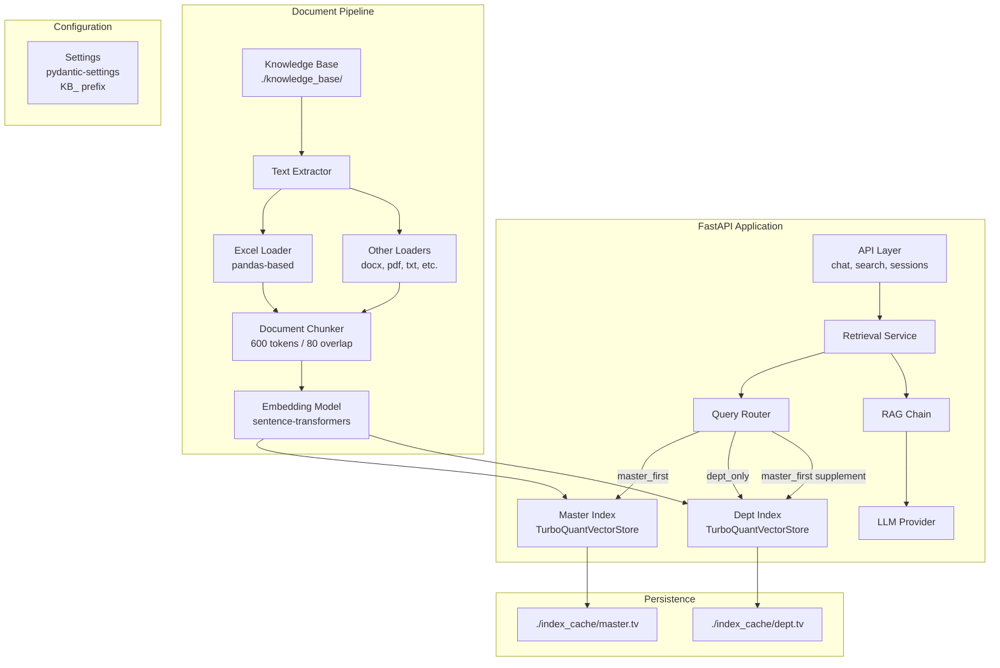
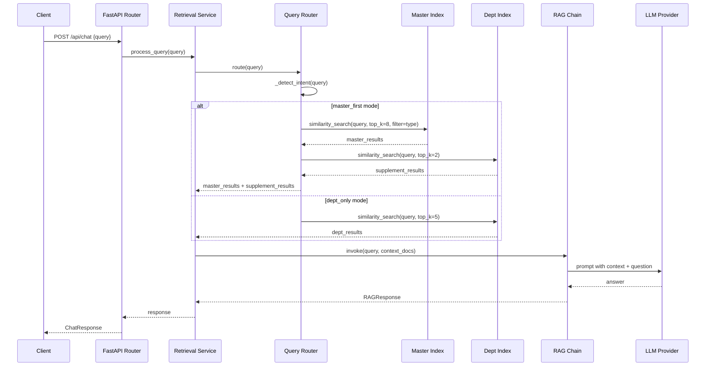

# Design Document: GraphRAG to TurboVec Migration

## Overview

This design describes the migration of the Executive Copilot's retrieval backend from a GraphRAG architecture (entity extraction, relationship mapping, community detection, community summaries) with ChromaDB to a streamlined dual-index TurboVec vector store with keyword-based intent routing.

The migration fundamentally simplifies the retrieval pipeline by:
1. **Removing** all graph-related components (entity extraction, relationship engine, community detection, GraphRAG engine) and their dependencies (spacy, networkx, leidenalg, igraph, chromadb)
2. **Replacing** ChromaDB with `turbovec[langchain]` using `TurboQuantVectorStore` at `bit_width=4`
3. **Introducing** a dual-index architecture (master + department) with a keyword-based query router for Bahasa Indonesia queries
4. **Updating** the system prompt to Indonesian and the Excel loader to produce structured row-per-sheet documents

The resulting system trades graph-enriched retrieval (which added complexity with marginal gains for this domain) for a faster, simpler vector-only retrieval path with intelligent intent-based routing.

## Architecture

### High-Level Architecture (Post-Migration)



### Data Flow: Query Processing



## Components and Interfaces

### 1. TurboVecStore (`app/services/turbovec_store.py`)

Replaces `ChromaVectorStore`. Manages dual TurboQuantVectorStore indexes.

```python
class TurboVecStore:
    """Dual-index TurboVec vector store with master and department indexes."""

    def __init__(self, settings: TurboVecSettings, embedding_model: EmbeddingModel):
        """Initialize with settings and embedding model."""
        ...

    def build_indexes(self, knowledge_base_path: str) -> None:
        """Build both indexes from scratch by scanning the knowledge base."""
        ...

    def load_from_cache(self) -> bool:
        """Attempt to load indexes from cache files. Returns True if successful."""
        ...

    def save_to_cache(self) -> None:
        """Persist both indexes to their cache files."""
        ...

    def similarity_search(
        self,
        query_embedding: list[float],
        index: str,  # "master" or "dept"
        top_k: int,
        filename_filter: str | None = None,
    ) -> list[dict]:
        """Search a specific index with optional filename filter."""
        ...

    def add_documents(
        self,
        dir_path: str,
        label: str,
        target: str = "dept",
    ) -> None:
        """Incrementally add documents to an existing index."""
        ...
```

### 2. QueryRouter (`app/services/query_router.py`)

New component. Routes queries to appropriate indexes based on Bahasa Indonesia keyword detection.

```python
@dataclass
class RoutingDecision:
    """Result of query routing."""
    mode: str  # "master_first" or "dept_only"
    filename_filter: str | None  # "barang", "outlet", "distributor", or None
    master_top_k: int
    dept_top_k: int

class QueryRouter:
    """Routes queries to appropriate TurboVec indexes based on keyword detection."""

    KEYWORD_SETS: list[tuple[list[str], str]] = [
        (["barang", "produk", "item", "sku", "kode barang"], "barang"),
        (["outlet", "toko", "gerai"], "outlet"),
        (["distributor", "dist", "agen"], "distributor"),
    ]

    def __init__(self, settings: TurboVecSettings):
        ...

    def route(self, query: str) -> RoutingDecision:
        """Determine routing based on query keywords."""
        ...

    def _detect_intent(self, query: str) -> tuple[str, str | None]:
        """Lowercase query and match against keyword sets. Returns (mode, filter)."""
        ...

    def retrieve(
        self,
        query: str,
        query_embedding: list[float],
        store: TurboVecStore,
    ) -> list[dict]:
        """Execute the full routing + retrieval pipeline."""
        ...
```

### 3. ExcelLoader (`app/services/excel_loader.py`)

New dedicated component replacing the inline `_extract_xlsx` method. Produces structured Documents.

```python
class ExcelLoader:
    """Loads Excel files into structured Documents with column-value pairs per row."""

    def load(self, file_path: Path) -> list[Document]:
        """Load an Excel file and return one Document per non-empty sheet."""
        ...

    def _process_sheet(
        self, df: pd.DataFrame, sheet_name: str, file_path: Path
    ) -> Document | None:
        """Convert a DataFrame to a Document with structured row format."""
        ...

    def _format_row(self, row: pd.Series, columns: list[str]) -> str:
        """Format a single row as 'KolomA: nilaiA | KolomB: nilaiB'."""
        ...
```

### 4. Updated RetrievalService (`app/services/retrieval_service.py`)

Simplified to use TurboVecStore + QueryRouter instead of ChromaDB + GraphRAG.

```python
class RetrievalService:
    """Handles search queries using TurboVec vector store with intent routing."""

    def __init__(self, store: TurboVecStore, router: QueryRouter, config: TurboVecSettings):
        ...

    def local_search(self, query: str, top_k: int, min_score: float, **kwargs) -> SearchResult:
        """Vector similarity search with intent routing."""
        ...

    def global_search(self, query: str, **kwargs) -> SearchResult:
        """Vector search using router logic (replaces community-based search)."""
        ...

    def combined_search(self, query: str, **kwargs) -> SearchResult:
        """Merged search using router with token budget."""
        ...
```

### 5. Updated RAGChain (`app/services/langchain/rag_chain.py`)

Simplified prompt with Indonesian template, single-message invocation.

```python
class RAGChain:
    """RAG chain with Indonesian business assistant prompt."""

    _SYSTEM_PROMPT_TEMPLATE: str = """Kamu adalah Executive Copilot, asisten bisnis cerdas..."""

    def invoke(self, query: str) -> RAGResponse:
        """Retrieve, substitute into template, invoke LLM."""
        ...
```

### 6. Updated Configuration (`app/config.py`)

Replaces `GraphRAGSettings` with `TurboVecSettings`.

```python
class TurboVecSettings(BaseSettings):
    """TurboVec and routing configuration with KB_ prefix."""

    # Chunking
    chunk_size: int = 600
    chunk_overlap: int = 80

    # Retrieval
    master_top_k: int = 8
    dept_top_k: int = 5
    master_first_supplement_k: int = 2

    # Paths
    index_cache_dir: str = "./index_cache"
    master_dir: str = "master"

    # Embedding
    embedding_model: str = "all-MiniLM-L6-v2"

    class Config:
        env_prefix = "KB_"
```

## Data Models

### Document Metadata Structure

Documents stored in TurboVec indexes carry the following metadata:

```python
{
    "file_id": int,           # Database file record ID
    "chunk_index": int,       # Sequential chunk index within the file
    "department": str,        # Department directory name
    "filename": str,          # Source filename (used for router filtering)
    "sheet_name": str | None, # Sheet name for Excel-sourced documents
}
```

### Index Structure

| Index | Cache File | Contents | Filter Field |
|-------|-----------|----------|-------------|
| `master_index` | `./index_cache/master.tv` | Documents from `knowledge_base/master/` | `filename` (barang, outlet, distributor) |
| `dept_index` | `./index_cache/dept.tv` | Documents from all other dept directories | `department` |

### Routing Decision Model

```python
@dataclass
class RoutingDecision:
    mode: str                    # "master_first" | "dept_only"
    filename_filter: str | None  # "barang" | "outlet" | "distributor" | None
    master_top_k: int            # Default 8
    dept_top_k: int              # Default 5 (dept_only) or 2 (supplement)
```

### Keyword Detection Mapping

| Priority | Keywords (Bahasa Indonesia) | Route | Filename Filter |
|----------|---------------------------|-------|----------------|
| 1 | barang, produk, item, sku, kode barang | master_first | "barang" |
| 2 | outlet, toko, gerai | master_first | "outlet" |
| 3 | distributor, dist, agen | master_first | "distributor" |
| — | (no match) | dept_only | None |

### Files Removed

| File | Reason |
|------|--------|
| `app/services/entity_extractor.py` | GraphRAG entity extraction |
| `app/services/relationship_extractor.py` | GraphRAG relationship extraction |
| `app/services/relationship_engine.py` | GraphRAG relationship engine |
| `app/services/community_detector.py` | GraphRAG community detection |
| `app/services/graphrag_engine.py` | GraphRAG orchestration |
| `app/services/vector_store.py` | ChromaDB vector store |
| `app/models/entity.py` | Entity database model |
| `app/models/entity_relationship.py` | EntityRelationship model |
| `app/models/community.py` | Community model |
| `app/models/relationship.py` | Relationship model |
| `app/routers/graph.py` | Graph API endpoints |
| `app/schemas/graph.py` | Graph schemas |
| `app/schemas/relationship.py` | Relationship schemas |

### Dependencies Removed

```
chromadb>=0.4.0
spacy>=3.7.0
networkx>=3.0
leidenalg>=0.10.0
igraph>=0.11.0
```

### Dependencies Added

```
turbovec[langchain]>=0.1.0
pandas>=1.5.0
```

## Correctness Properties

*A property is a characteristic or behavior that should hold true across all valid executions of a system — essentially, a formal statement about what the system should do. Properties serve as the bridge between human-readable specifications and machine-verifiable correctness guarantees.*

### Property 1: Keyword routing correctness

*For any* query string containing at least one keyword from a master keyword set (barang/produk/item/sku/kode barang, outlet/toko/gerai, distributor/dist/agen), the Query Router SHALL route to `master_index` with the filename filter corresponding to the first matching keyword set in priority order.

**Validates: Requirements 4.2, 4.3, 4.4, 4.5**

### Property 2: Non-matching queries default to department index

*For any* query string that does not contain any keyword from any master keyword set (including empty strings and whitespace-only strings), the Query Router SHALL produce a `dept_only` routing decision with no filename filter.

**Validates: Requirements 4.6, 4.9**

### Property 3: Master-first retrieval ordering invariant

*For any* query that triggers `master_first` routing mode, the retrieved results SHALL contain master index results ordered before department supplement results, and within each group results SHALL be ordered by descending similarity score.

**Validates: Requirements 4.7, 4.8**

### Property 4: Excel loader structured row format

*For any* valid Excel file with at least one sheet containing data rows, the Excel Loader SHALL produce a Document whose page_content consists of rows formatted as `ColumnName: Value | ColumnName: Value` (omitting NaN/empty columns) joined by newline separators, with one Document per non-empty sheet containing correct metadata (sheet_name, source, filename).

**Validates: Requirements 6.2, 6.3, 6.4**

### Property 5: Empty sheets produce no Documents

*For any* Excel sheet that contains only a header row with zero non-empty data rows, the Excel Loader SHALL skip that sheet and produce no Document for it.

**Validates: Requirements 6.5**

### Property 6: RAG chain prompt substitution

*For any* list of retrieved document chunks and any query string, the RAG Chain SHALL produce a single prompt message where `{context}` is substituted with the chunks joined by blank lines and `{question}` is substituted with the query text.

**Validates: Requirements 7.3, 7.5**

### Property 7: Configuration validation with fallback

*For any* integer configuration constant (MASTER_TOP_K, DEPT_TOP_K, MASTER_FIRST_SUPPLEMENT_K, CHUNK_SIZE, CHUNK_OVERLAP) with a defined valid range, setting an environment variable to a non-integer value or a value outside the valid range SHALL result in the documented default value being applied.

**Validates: Requirements 11.1, 11.2, 11.3, 11.7, 5.4**

### Property 8: Chunk overlap validation

*For any* configured `chunk_overlap` value that exceeds `chunk_size // 2`, the configuration SHALL fall back to the default `chunk_overlap` of 80.

**Validates: Requirements 5.4**

### Property 9: Incremental ingestion label attachment

*For any* call to `add_documents(dir_path, label, target)` with a valid directory containing supported files, all resulting document chunks added to the target index SHALL have the provided `label` attached as metadata.

**Validates: Requirements 8.2**

### Property 10: Incremental ingestion error handling

*For any* call to `add_documents` where `dir_path` does not exist, contains no supported files, or `target` is not "master" or "dept", the method SHALL raise an error without modifying any existing index.

**Validates: Requirements 8.4, 8.5**

### Property 11: Document partitioning into dual indexes

*For any* knowledge base directory structure containing a `master/` subdirectory and other department subdirectories, the TurboVec Store SHALL partition documents such that all documents from `master/` are in `master_index` and all other documents are in `dept_index`, with no document appearing in both indexes.

**Validates: Requirements 3.1**

## Error Handling

### Startup Errors

| Condition | Behavior |
|-----------|----------|
| Cache file corrupted/incompatible | Log warning, discard cache, rebuild index from knowledge base |
| Knowledge base empty (no supported files) | Create empty indexes, save to cache, log warning |
| Embedding model unavailable | Raise exception, prevent application startup |
| Index build failure (unrecoverable) | Raise exception, prevent application startup |

### Runtime Errors

| Condition | Behavior |
|-----------|----------|
| Query empty or whitespace-only | Route to `dept_index` with no filter (not an error) |
| Query exceeds 1000 characters | Return HTTP 400 with descriptive message |
| LLM provider unavailable | Return HTTP 503 with retry guidance |
| Similarity search returns zero results | Invoke LLM with empty context (produces "Data tidak ditemukan..." response) |
| `add_documents` with invalid path | Raise ValueError with descriptive message |
| `add_documents` with invalid target | Raise ValueError with descriptive message |

### API Error Codes (Preserved)

| Code | Condition |
|------|-----------|
| 400 | Invalid query (empty, too long) |
| 422 | Request validation failure (Pydantic) |
| 500 | Internal server error |
| 503 | LLM service unavailable |
| 504 | LLM request timeout |

## Testing Strategy

### Property-Based Testing

Property-based tests use **Hypothesis** (already present in the project as evidenced by `.hypothesis/` directory) with a minimum of 100 iterations per property.

**Library:** `hypothesis` (Python)

**Configuration:** Each property test runs with `@settings(max_examples=100)` minimum.

**Tag Format:** Each test is annotated with:
```python
# Feature: graphrag-to-turbovec-migration, Property N: <property_text>
```

**Properties to implement as PBT:**
1. Keyword routing correctness (Property 1)
2. Non-matching queries default to dept (Property 2)
3. Master-first retrieval ordering (Property 3)
4. Excel loader row format (Property 4)
5. Empty sheets produce no Documents (Property 5)
6. RAG chain prompt substitution (Property 6)
7. Configuration validation with fallback (Property 7)
8. Chunk overlap validation (Property 8)
9. Incremental ingestion label attachment (Property 9)
10. Incremental ingestion error handling (Property 10)
11. Document partitioning into dual indexes (Property 11)

### Unit Tests (Example-Based)

Focus on specific scenarios not covered by property tests:

- Cache loading/saving behavior (load from cache, build when missing)
- TurboQuantVectorStore instantiation with `bit_width=4`
- System prompt template exact match
- Single-message LLM invocation pattern
- Zero-document retrieval still invokes LLM
- Graph endpoint returns 404
- API schema backward compatibility

### Integration Tests

- Full startup lifecycle with TurboVec initialization
- End-to-end query flow through router → index → RAG chain
- `pip install` dependency resolution in clean environment
- Re-indexing triggered by chunking parameter changes

### Smoke Tests

- Removed files no longer exist in services directory
- No imports of removed modules anywhere in codebase
- Requirements.txt contains turbovec[langchain], pandas; lacks chromadb, spacy, networkx, leidenalg, igraph
- All API endpoints still registered and reachable
- Application starts successfully without graph dependencies installed
