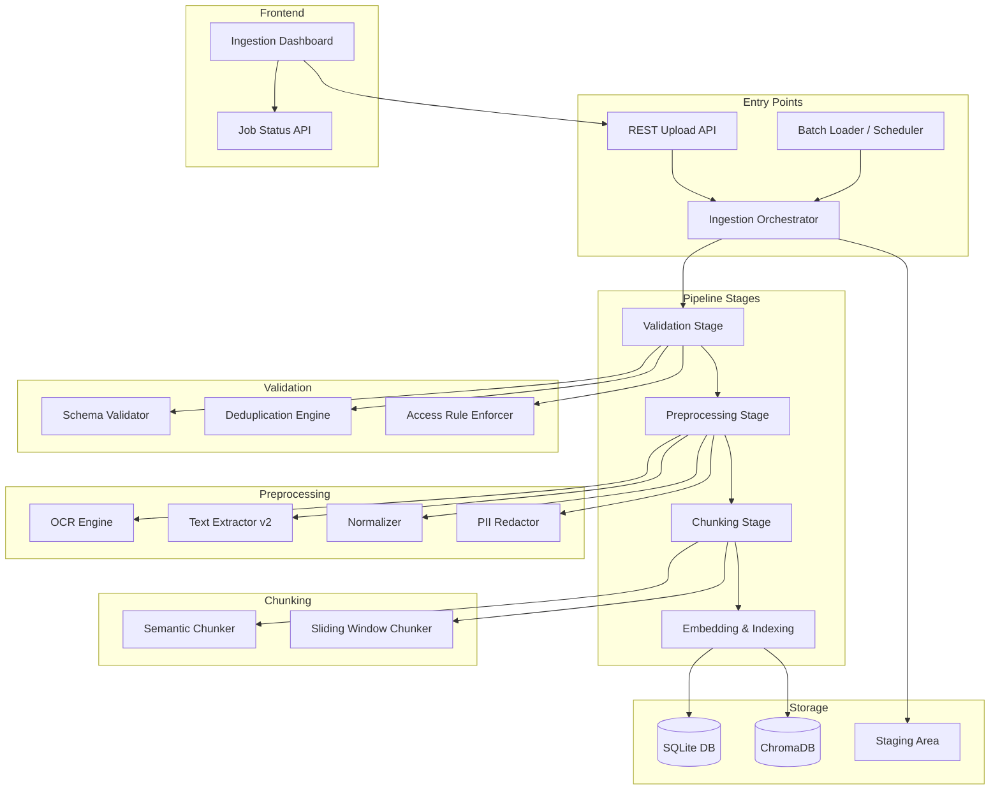
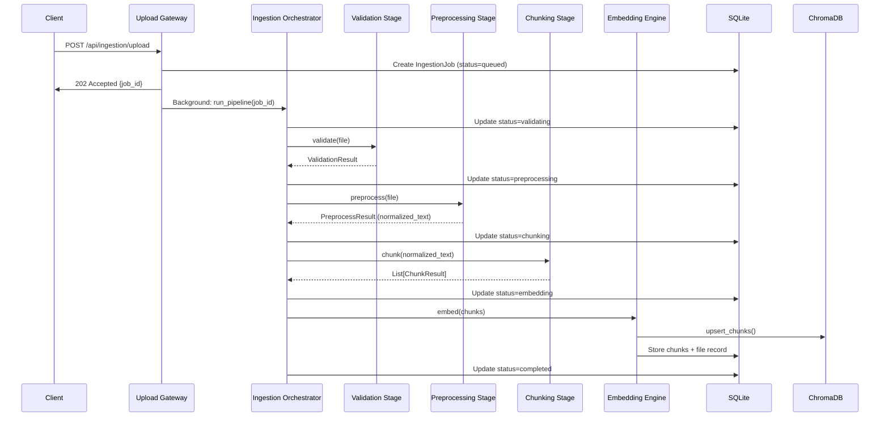

# Design Document: Ingestion Pipeline

## Overview

The Ingestion Pipeline is a multi-stage document processing system that replaces the current simple file upload flow in the Executive Copilot Knowledge Base Manager. It introduces a structured pipeline with five stages: Upload Gateway, Validation, Preprocessing, Chunking, and Embedding/Indexing.

The pipeline is designed as a set of composable services that integrate with the existing FastAPI backend, SQLAlchemy/SQLite database, and ChromaDB vector store. Each stage is independently testable and communicates through well-defined interfaces, with an `IngestionJob` model tracking progress through the pipeline.

### Key Design Decisions

1. **Synchronous pipeline with async upload**: The upload endpoint returns immediately with a job ID, but pipeline processing runs synchronously in a background task (using FastAPI's `BackgroundTasks`). This avoids the complexity of a message queue while supporting concurrent uploads.

2. **Extend existing services**: The pipeline extends `TextExtractor` and `DocumentChunker` rather than replacing them, preserving backward compatibility with the existing sync engine.

3. **Stage-based error isolation**: Each pipeline stage catches its own errors and updates the job status, so a failure in OCR doesn't corrupt the validation results.

4. **SQLite-compatible scheduling**: The Batch Loader uses APScheduler with a SQLite job store, avoiding external dependencies like Redis or Celery.

## Architecture



### Component Interaction Flow



## Components and Interfaces

### 1. Upload Gateway (`app/routers/ingestion.py`)

**Responsibility**: Accept file uploads, validate request metadata, create ingestion jobs, and dispatch to the pipeline orchestrator.

```python
# Router endpoints
POST /api/ingestion/upload          # Single file upload
POST /api/ingestion/upload/batch    # Multi-file upload
GET  /api/ingestion/jobs            # List jobs (filterable)
GET  /api/ingestion/jobs/{job_id}   # Job status detail
```

**Interface**:
```python
class UploadRequest:
    file: UploadFile
    department: str
    subfolder: str | None = None
    tags: list[str] = []

class UploadResponse:
    job_id: str
    status: str
    created_at: datetime

class BatchUploadResponse:
    jobs: list[UploadResponse]
```

### 2. Ingestion Orchestrator (`app/services/ingestion/orchestrator.py`)

**Responsibility**: Coordinate the pipeline stages for a given job, update status at each transition, and handle stage failures.

```python
class IngestionOrchestrator:
    def run_pipeline(self, job_id: str) -> None: ...
    def _run_validation(self, job: IngestionJob) -> ValidationResult: ...
    def _run_preprocessing(self, job: IngestionJob, file_path: Path) -> PreprocessResult: ...
    def _run_chunking(self, job: IngestionJob, text: str, metadata: StructureMetadata) -> list[ChunkResult]: ...
    def _run_embedding(self, job: IngestionJob, chunks: list[ChunkResult]) -> None: ...
```

### 3. Schema Validator (`app/services/ingestion/schema_validator.py`)

**Responsibility**: Verify file extension support, magic bytes, and format-specific structural validity.

```python
class SchemaValidator:
    SUPPORTED_FORMATS: set[str]
    MAGIC_BYTES: dict[str, bytes]
    
    def validate(self, file_path: Path, declared_format: str) -> ValidationResult: ...
    def _check_magic_bytes(self, file_path: Path, expected_format: str) -> bool: ...
    def _validate_json(self, file_path: Path) -> bool: ...
    def _validate_pdf(self, file_path: Path) -> bool: ...
```

### 4. Deduplication Engine (`app/services/ingestion/deduplication.py`)

**Responsibility**: Detect exact and near-duplicate documents using content hashing and MinHash similarity.

```python
class DeduplicationEngine:
    def check_duplicate(self, file_path: Path, db: Session) -> DeduplicationResult: ...
    def compute_content_hash(self, file_path: Path) -> str: ...
    def compute_minhash(self, text: str) -> MinHashSignature: ...
    def find_near_duplicates(self, signature: MinHashSignature, db: Session, threshold: float = 0.9) -> list[int]: ...
```

### 5. Access Rule Enforcer (`app/services/ingestion/access_rules.py`)

**Responsibility**: Verify department existence, subfolder validity, and sensitivity-level authorization.

```python
class AccessRuleEnforcer:
    def enforce(self, department: str, subfolder: str | None, source_auth: str | None) -> AccessResult: ...
    def _validate_department(self, department: str) -> bool: ...
    def _validate_subfolder(self, department: str, subfolder: str | None) -> bool: ...
    def _check_confidential_access(self, department: str, subfolder: str, source_auth: str | None) -> bool: ...
```

### 6. OCR Engine (`app/services/ingestion/ocr_engine.py`)

**Responsibility**: Extract text from image-based documents using Tesseract or AWS Textract.

```python
class OCREngine:
    def extract_text(self, file_path: Path) -> OCRResult: ...
    def _needs_ocr(self, file_path: Path) -> bool: ...
    def _run_tesseract(self, file_path: Path) -> tuple[str, float]: ...
    def _run_textract(self, file_path: Path) -> tuple[str, float]: ...
```

### 7. Normalizer (`app/services/ingestion/normalizer.py`)

**Responsibility**: Normalize extracted text to NFC Unicode, collapse whitespace, remove control characters, and preserve structure.

```python
class TextNormalizer:
    def normalize(self, text: str) -> NormalizedText: ...
    def _normalize_unicode(self, text: str) -> str: ...
    def _collapse_whitespace(self, text: str) -> str: ...
    def _remove_control_chars(self, text: str) -> str: ...
    def _extract_structure(self, text: str) -> StructureMetadata: ...
```

### 8. PII Redactor (`app/services/ingestion/pii_redactor.py`)

**Responsibility**: Detect and mask PII (NIK, phone, email, names) with category-specific placeholders.

```python
class PIIRedactor:
    def redact(self, text: str) -> RedactionResult: ...
    def _detect_nik(self, text: str) -> list[PIISpan]: ...
    def _detect_phone(self, text: str) -> list[PIISpan]: ...
    def _detect_email(self, text: str) -> list[PIISpan]: ...
    def _detect_names(self, text: str) -> list[PIISpan]: ...
    def _is_in_code_block(self, text: str, span: PIISpan) -> bool: ...
```

### 9. Semantic Chunker (`app/services/ingestion/semantic_chunker.py`)

**Responsibility**: Split documents at semantic boundaries (headings, sections, topic shifts) with target chunk sizes.

```python
class SemanticChunker:
    def chunk(self, text: str, structure: StructureMetadata) -> list[SemanticChunkResult]: ...
    def _identify_boundaries(self, text: str, structure: StructureMetadata) -> list[int]: ...
    def _split_at_boundaries(self, text: str, boundaries: list[int]) -> list[str]: ...
    def _merge_small_sections(self, sections: list[str]) -> list[str]: ...
```

### 10. Sliding Window Chunker (`app/services/ingestion/sliding_window_chunker.py`)

**Responsibility**: Chunk long sections without semantic boundaries using overlapping fixed-size windows with sentence alignment.

```python
class SlidingWindowChunker:
    def chunk(self, text: str, window_size: int = 512, overlap: int = 64) -> list[SlidingWindowChunkResult]: ...
    def _find_sentence_boundary(self, text: str, target_pos: int, tolerance: float = 0.1) -> int: ...
    def _merge_final_chunk(self, chunks: list[str], min_size: int = 128) -> list[str]: ...
```

### 11. Batch Loader (`app/services/ingestion/batch_loader.py`)

**Responsibility**: Scheduled scanning of external sources for new/modified files, submitting them to the pipeline.

```python
class BatchLoader:
    def configure(self, config: BatchLoaderConfig) -> None: ...
    def execute_scan(self, config_id: str) -> BatchExecutionLog: ...
    def _scan_local_path(self, path: str) -> list[Path]: ...
    def _scan_s3_uri(self, uri: str) -> list[Path]: ...
    def _is_already_ingested(self, file_path: Path, content_hash: str) -> bool: ...
```

### 12. Batch Loader Scheduler (`app/services/ingestion/scheduler.py`)

**Responsibility**: Manage cron-based scheduling of batch loader executions using APScheduler.

```python
class BatchScheduler:
    def start(self) -> None: ...
    def add_schedule(self, config: BatchLoaderConfig) -> str: ...
    def remove_schedule(self, config_id: str) -> None: ...
    def get_next_run(self, config_id: str) -> datetime | None: ...
```

## Data Models

### New SQLAlchemy Models

```python
# app/models/ingestion_job.py
class IngestionJob(Base):
    __tablename__ = "ingestion_jobs"

    id = Column(String, primary_key=True)  # UUID
    file_name = Column(String, nullable=False)
    file_size = Column(Integer, nullable=False)
    department = Column(String, nullable=False)
    subfolder = Column(String, nullable=True)
    status = Column(String, nullable=False, default="queued")
    # Status values: queued, validating, preprocessing, chunking, embedding, completed, failed,
    #                validation_failed, duplicate_exact, duplicate_near, access_denied
    current_stage = Column(String, nullable=True)
    error_code = Column(String, nullable=True)
    error_message = Column(String, nullable=True)
    failure_stage = Column(String, nullable=True)
    staging_path = Column(String, nullable=True)
    content_hash = Column(String, nullable=True)
    duplicate_of_file_id = Column(Integer, ForeignKey("files.id"), nullable=True)
    sensitivity_level = Column(String, nullable=True)
    created_at = Column(DateTime, nullable=False)
    updated_at = Column(DateTime, nullable=False)
    completed_at = Column(DateTime, nullable=True)
    file_id = Column(Integer, ForeignKey("files.id"), nullable=True)  # Set on completion


# app/models/ingestion_stage_log.py
class IngestionStageLog(Base):
    __tablename__ = "ingestion_stage_logs"

    id = Column(Integer, primary_key=True, autoincrement=True)
    job_id = Column(String, ForeignKey("ingestion_jobs.id"), nullable=False, index=True)
    stage = Column(String, nullable=False)
    status = Column(String, nullable=False)  # started, completed, failed
    started_at = Column(DateTime, nullable=False)
    completed_at = Column(DateTime, nullable=True)
    details = Column(JSON, nullable=True)  # Stage-specific metadata


# app/models/batch_loader_config.py
class BatchLoaderConfig(Base):
    __tablename__ = "batch_loader_configs"

    id = Column(String, primary_key=True)  # UUID
    name = Column(String, nullable=False)
    source_path = Column(String, nullable=False)  # Local path or S3 URI
    source_type = Column(String, nullable=False)  # "local" or "s3"
    cron_expression = Column(String, nullable=False)
    department = Column(String, nullable=False)
    subfolder = Column(String, nullable=True)
    is_active = Column(Boolean, default=True)
    created_at = Column(DateTime, nullable=False)
    updated_at = Column(DateTime, nullable=False)
    last_execution_at = Column(DateTime, nullable=True)
    last_execution_status = Column(String, nullable=True)


# app/models/batch_execution_log.py
class BatchExecutionLog(Base):
    __tablename__ = "batch_execution_logs"

    id = Column(Integer, primary_key=True, autoincrement=True)
    config_id = Column(String, ForeignKey("batch_loader_configs.id"), nullable=False, index=True)
    started_at = Column(DateTime, nullable=False)
    completed_at = Column(DateTime, nullable=True)
    files_found = Column(Integer, default=0)
    files_submitted = Column(Integer, default=0)
    files_skipped = Column(Integer, default=0)  # Already ingested
    errors = Column(JSON, nullable=True)
    status = Column(String, nullable=False)  # running, completed, failed


# app/models/pii_redaction_log.py
class PIIRedactionLog(Base):
    __tablename__ = "pii_redaction_logs"

    id = Column(Integer, primary_key=True, autoincrement=True)
    job_id = Column(String, ForeignKey("ingestion_jobs.id"), nullable=False, index=True)
    category = Column(String, nullable=False)  # EMAIL, PHONE, NIK, NAME
    original_start = Column(Integer, nullable=False)
    original_end = Column(Integer, nullable=False)
    placeholder = Column(String, nullable=False)
    confidence = Column(Float, nullable=True)
    flagged_for_review = Column(Boolean, default=False)
```

### Extended Chunk Model

The existing `Chunk` model is extended with additional metadata fields:

```python
# Additional columns for app/models/chunk.py
class Chunk(Base):
    # ... existing columns ...
    section_path = Column(String, nullable=True)       # Hierarchical heading trail
    chunking_method = Column(String, nullable=True)    # "semantic" or "sliding_window"
    job_id = Column(String, ForeignKey("ingestion_jobs.id"), nullable=True)
```

### Pydantic Schemas

```python
# app/schemas/ingestion.py
class IngestionJobResponse(BaseModel):
    id: str
    file_name: str
    file_size: int
    department: str
    subfolder: str | None
    status: str
    current_stage: str | None
    error_code: str | None
    error_message: str | None
    failure_stage: str | None
    created_at: datetime
    updated_at: datetime
    completed_at: datetime | None
    stages: list[StageLogResponse] = []

class StageLogResponse(BaseModel):
    stage: str
    status: str
    started_at: datetime
    completed_at: datetime | None
    details: dict | None

class JobListResponse(BaseModel):
    jobs: list[IngestionJobResponse]
    total: int
    page: int
    page_size: int

class BatchLoaderConfigResponse(BaseModel):
    id: str
    name: str
    source_path: str
    source_type: str
    cron_expression: str
    department: str
    subfolder: str | None
    is_active: bool
    last_execution_at: datetime | None
    last_execution_status: str | None
    next_execution_at: datetime | None
```

### Configuration Extensions

```python
# Added to app/config.py
class IngestionSettings(BaseSettings):
    max_file_size_mb: int = 100
    staging_path: str = "./staging"
    supported_formats: list[str] = [".txt", ".md", ".json", ".docx", ".pdf", ".csv", ".xlsx", ".xls", ".png", ".jpg", ".tiff"]
    ocr_provider: str = "tesseract"  # "tesseract" or "textract"
    ocr_confidence_threshold: float = 0.6
    pii_confidence_threshold: float = 0.7
    dedup_similarity_threshold: float = 0.9
    semantic_chunk_min_tokens: int = 256
    semantic_chunk_max_tokens: int = 1024
    sliding_window_size: int = 512
    sliding_window_overlap: int = 64
    sliding_window_min_chunk: int = 128
    job_retention_days: int = 30
    max_concurrent_uploads: int = 10

    class Config:
        env_prefix = "KB_INGESTION_"
```

## Correctness Properties

*A property is a characteristic or behavior that should hold true across all valid executions of a system—essentially, a formal statement about what the system should do. Properties serve as the bridge between human-readable specifications and machine-verifiable correctness guarantees.*

### Property 1: File size acceptance boundary

*For any* file submitted to the Upload Gateway, the file SHALL be accepted if and only if its size is less than or equal to the configured maximum (100MB). Files exceeding the maximum SHALL be rejected.

**Validates: Requirements 1.2**

### Property 2: Batch upload job count

*For any* batch upload request containing N files (where N ≥ 1), the response SHALL contain exactly N unique Ingestion_Job identifiers.

**Validates: Requirements 1.6**

### Property 3: Missing metadata detection

*For any* upload request with a subset of required metadata fields missing, the rejection response SHALL list exactly the fields that are absent from the request.

**Validates: Requirements 1.7**

### Property 4: Batch loader new file detection

*For any* set of files in a source directory with known modification timestamps, and a given last-execution timestamp, the Batch Loader SHALL detect exactly those files whose modification time is after the last-execution timestamp.

**Validates: Requirements 2.2**

### Property 5: Source path format validation

*For any* string submitted as a Batch Loader source path, the validator SHALL accept it if and only if it matches a valid local filesystem path pattern or a valid S3 URI pattern (s3://bucket/prefix).

**Validates: Requirements 2.6**

### Property 6: Batch loader skip already-ingested files

*For any* file whose content hash already exists in the batch loader's tracking store, the Batch Loader SHALL skip that file and not submit it as a new Ingestion_Job.

**Validates: Requirements 2.7**

### Property 7: Schema validation correctness

*For any* file submitted to the Schema Validator, the file SHALL pass validation if and only if: (a) its extension is in the supported formats set, AND (b) its content bytes match the expected magic bytes for the declared format, AND (c) format-specific structural checks pass (valid JSON parse, valid PDF header, etc.).

**Validates: Requirements 3.1, 3.2, 3.4, 3.5**

### Property 8: Exact duplicate detection

*For any* two files with identical byte content, the Deduplication Engine SHALL compute identical content hashes and detect the second file as an exact duplicate of the first.

**Validates: Requirements 4.1, 4.2**

### Property 9: Near-duplicate detection

*For any* two text documents with MinHash similarity above 0.9, the Deduplication Engine SHALL detect the second document as a near-duplicate of the first. For any two documents with similarity below 0.9, they SHALL NOT be flagged as near-duplicates.

**Validates: Requirements 4.3**

### Property 10: Deduplication confluence

*For any* set of files processed through the deduplication engine, the deduplication decisions (which files are marked as duplicates of which) SHALL be identical regardless of the order in which files are processed.

**Validates: Requirements 4.6**

### Property 11: Access rule validation

*For any* (department, subfolder, source_authorization) tuple, the Access Rule Enforcer SHALL accept the submission if and only if: (a) the department exists in the configured list, AND (b) the subfolder is valid for that department, AND (c) if the subfolder has "Confidential" sensitivity, the source has explicit confidential authorization.

**Validates: Requirements 5.1, 5.2, 5.3**

### Property 12: Sensitivity level annotation

*For any* file that passes all access rule checks, the resolved sensitivity level annotated on the Ingestion_Job SHALL equal the configured sensitivity level of the target subfolder.

**Validates: Requirements 5.5**

### Property 13: OCR confidence flagging

*For any* OCR extraction result, the Ingestion_Job SHALL be flagged for manual review if and only if the confidence score is below 0.6.

**Validates: Requirements 6.6**

### Property 14: Text normalization correctness

*For any* text input, the Normalizer output SHALL satisfy all of: (a) the text is in NFC Unicode form, (b) no consecutive whitespace characters exist except preserved double newlines (paragraph boundaries), and (c) no control characters exist except newline (\n) and tab (\t).

**Validates: Requirements 7.2, 7.3, 7.4**

### Property 15: Normalization idempotence

*For any* text input, applying the normalization function twice SHALL produce the same result as applying it once: `normalize(normalize(text)) == normalize(text)`.

**Validates: Requirements 7.6**

### Property 16: PII detection and placeholder replacement

*For any* text containing PII patterns (Indonesian NIK numbers, Indonesian phone numbers, email addresses, person names) outside of code blocks, the PII Redactor SHALL replace each detected instance with the correct category-specific placeholder ([REDACTED_NIK], [REDACTED_PHONE], [REDACTED_EMAIL], [REDACTED_NAME]).

**Validates: Requirements 8.1, 8.2**

### Property 17: PII redaction offset logging

*For any* PII span redacted from a text, the redaction log SHALL record character offsets (start, end) that, when applied to the original text, extract exactly the PII content that was replaced.

**Validates: Requirements 8.3**

### Property 18: PII code block exclusion

*For any* text containing PII-like patterns within code blocks (delimited by triple backticks or indented 4+ spaces), the PII Redactor SHALL NOT modify those patterns. Only PII patterns in prose text SHALL be redacted.

**Validates: Requirements 8.4**

### Property 19: PII confidence-based flagging

*For any* PII match with confidence below 0.7, the PII Redactor SHALL flag the span for manual review and SHALL NOT automatically redact it. For matches with confidence ≥ 0.7, automatic redaction SHALL proceed.

**Validates: Requirements 8.5**

### Property 20: PII and normalization confluence

*For any* text input, applying PII redaction then normalization SHALL produce the same result as applying normalization then PII redaction: `normalize(redact(text)) == redact(normalize(text))`.

**Validates: Requirements 8.6**

### Property 21: Semantic chunk size bounds with delegation

*For any* document processed by the Semantic Chunker, all chunks produced directly by semantic chunking SHALL have token counts between 256 and 1024. Any semantic section exceeding 1024 tokens SHALL be delegated to the Sliding Window Chunker (indicated by chunking_method="sliding_window" in metadata).

**Validates: Requirements 9.2, 9.3**

### Property 22: Chunk heading and metadata completeness

*For any* chunk produced by the Semantic Chunker, the chunk SHALL: (a) be prepended with its parent section heading, and (b) include all required metadata fields (chunk_index, start_offset, end_offset, section_path, chunking_method) with non-null values.

**Validates: Requirements 9.4, 9.5**

### Property 23: Chunking round-trip

*For any* normalized document, concatenating all chunk texts produced by the Semantic Chunker (excluding prepended section headings) SHALL reconstruct the original document text exactly, with no content lost or duplicated.

**Validates: Requirements 9.6**

### Property 24: Sliding window sentence alignment

*For any* text section processed by the Sliding Window Chunker where a sentence boundary exists within 10% of the target split point, the chunk boundary SHALL align to that sentence ending rather than splitting mid-sentence.

**Validates: Requirements 10.3**

### Property 25: Sliding window minimum chunk size

*For any* text section processed by the Sliding Window Chunker, all produced chunks SHALL contain at least 128 tokens. If the final chunk would be below 128 tokens, it SHALL be merged with the previous chunk.

**Validates: Requirements 10.4**

### Property 26: Sliding window completeness

*For any* text section processed by the Sliding Window Chunker, the union of all chunk token spans SHALL cover every token in the input section without gaps.

**Validates: Requirements 10.5**

### Property 27: Job status transitions and failure recording

*For any* Ingestion_Job that progresses through the pipeline, each stage transition SHALL update the job status to the correct stage name. For any job that fails, the failure_stage, error_code, and error_message fields SHALL all be non-null and correctly identify the failure point.

**Validates: Requirements 11.2, 11.3**

### Property 28: Job list filtering correctness

*For any* combination of filters (status, department, date range) applied to the jobs list endpoint, every returned job SHALL match ALL specified filter criteria, and no job matching all criteria SHALL be excluded from the results.

**Validates: Requirements 11.6**

## Error Handling

### Pipeline Stage Errors

Each pipeline stage implements isolated error handling:

| Stage | Error Type | Job Status | Recovery |
|-------|-----------|------------|----------|
| Upload | File too large | N/A (rejected at gateway) | Client resubmits smaller file |
| Upload | Missing metadata | N/A (rejected at gateway) | Client adds required fields |
| Validation | Unsupported format | `validation_failed` | Manual: convert to supported format |
| Validation | Magic bytes mismatch | `validation_failed` | Manual: fix file corruption |
| Validation | Invalid JSON/PDF | `validation_failed` | Manual: fix file content |
| Deduplication | Exact duplicate | `duplicate_exact` | Admin override or skip |
| Deduplication | Near duplicate | `duplicate_near` | Admin override or skip |
| Access Rules | Invalid department | `access_denied` | Resubmit with valid department |
| Access Rules | Unauthorized confidential | `access_denied` | Request authorization |
| OCR | Low confidence | `completed` (flagged) | Manual review of extracted text |
| OCR | Engine failure | `failed` | Retry or switch OCR provider |
| Preprocessing | Parse failure | `failed` | Manual: check file integrity |
| Chunking | Tokenizer failure | `failed` | Retry with fallback chunker |
| Embedding | Vector store unavailable | `failed` | Retry when ChromaDB recovers |

### Batch Loader Errors

| Error | Behavior | Recovery |
|-------|----------|----------|
| Source unreachable | Log error, skip execution | Automatic retry at next interval |
| Permission denied | Log error, skip file | Manual: fix permissions |
| File read error | Log error, continue with other files | Manual: check file |
| Pipeline submission failure | Log error, continue with other files | Automatic retry next scan |

### Error Response Format

All API error responses follow a consistent structure:

```python
class ErrorResponse(BaseModel):
    error_code: str          # Machine-readable code (e.g., "FILE_TOO_LARGE")
    message: str             # Human-readable description
    details: dict | None     # Additional context (e.g., {"max_size_mb": 100, "actual_size_mb": 150})
    timestamp: datetime
```

### Retry Strategy

- **Transient failures** (network timeouts, temporary unavailability): Exponential backoff with 3 retries
- **Permanent failures** (invalid file, access denied): No retry, immediate failure status
- **Batch loader**: No retry within execution; relies on next scheduled interval

## Testing Strategy

### Property-Based Testing (Hypothesis)

The project already uses Hypothesis (v6.112.1) for property-based testing. Each correctness property above maps to one property-based test with a minimum of 100 iterations.

**Library**: `hypothesis` (already in dev dependencies)
**Configuration**: Each test runs with `@settings(max_examples=100)`
**Tagging**: Each test includes a docstring with format: `Feature: ingestion-pipeline, Property {N}: {title}`

**Property test files**:
- `tests/test_ingestion_validation_properties.py` — Properties 1-3, 7-10
- `tests/test_ingestion_access_properties.py` — Properties 11-12
- `tests/test_ingestion_normalization_properties.py` — Properties 14-15
- `tests/test_ingestion_pii_properties.py` — Properties 16-20
- `tests/test_ingestion_chunking_properties.py` — Properties 21-26
- `tests/test_ingestion_pipeline_properties.py` — Properties 4-6, 13, 27-28

### Unit Tests (Example-Based)

Unit tests cover specific examples, edge cases, and integration points:

- **Upload Gateway**: HTTP 413 for oversized files, HTTP 422 for missing metadata, correct staging path
- **Schema Validator**: Specific file format validations with known-good and known-bad files
- **Deduplication**: Known duplicate pairs, boundary cases at 90% similarity
- **Access Rules**: Specific department/subfolder combinations, confidential access scenarios
- **OCR**: Known image files with expected text output
- **PII Redactor**: Known PII patterns, code block edge cases
- **Chunking**: Documents with known structure, boundary conditions
- **Job Tracking**: State machine transitions, cleanup after 30 days

### Integration Tests

- **End-to-end pipeline**: Upload a file and verify it appears in ChromaDB with correct chunks
- **Batch Loader**: Configure a schedule, add files to source, verify they're ingested
- **Frontend**: API contract tests ensuring the dashboard receives correct data shapes
- **Concurrent uploads**: Verify 10 simultaneous uploads complete without errors

### Frontend Tests (Vitest)

- Component rendering tests for the ingestion dashboard
- API integration tests using MSW (Mock Service Worker)
- User interaction tests for upload form and job detail views

