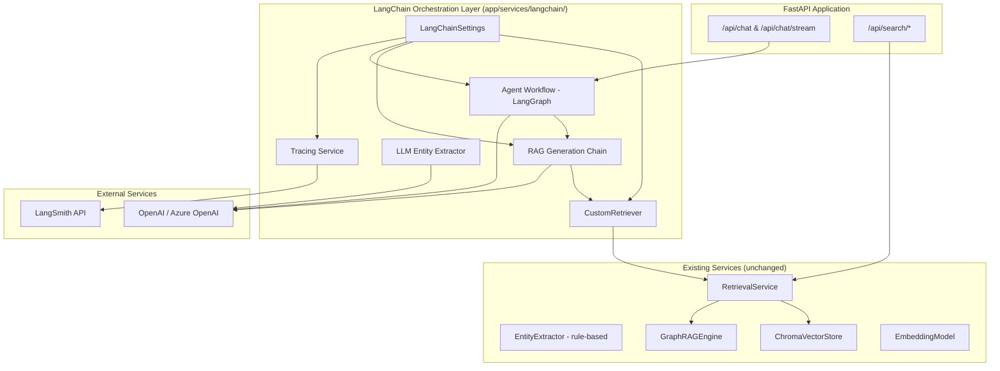
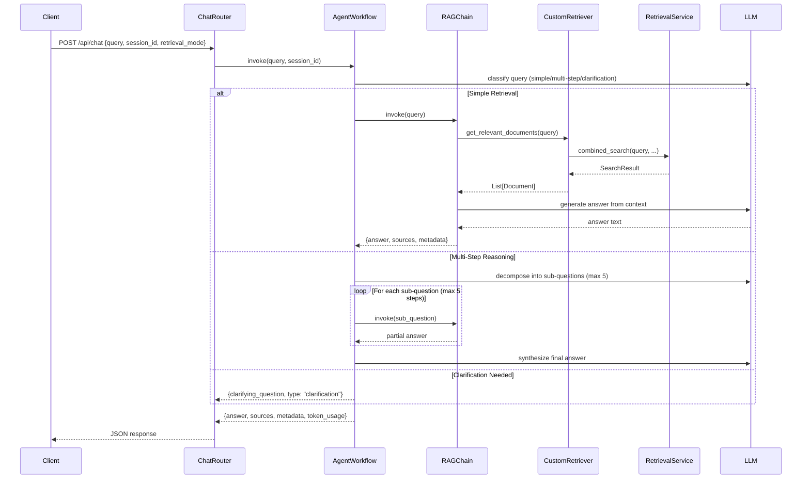

# Design Document: LangChain Integration

## Overview

This design introduces a LangChain-based orchestration layer on top of the existing GraphRAG retrieval pipeline. The integration adds LLM-powered generation (RAG), LLM-based entity extraction, multi-step agentic workflows via LangGraph, and observability via LangSmith — all without modifying existing services.

The new code lives entirely under `app/services/langchain/` and exposes two new API endpoints (`/api/chat` and `/api/chat/stream`) while preserving all existing retrieval endpoints unchanged.

### Key Design Decisions

1. **Adapter Pattern for Retriever**: Wrap `RetrievalService` as a LangChain `BaseRetriever` rather than reimplementing retrieval logic, ensuring the existing tested pipeline remains the source of truth.
2. **Graceful Degradation**: If LLM configuration is missing or packages fail to import, the system continues serving retrieval-only endpoints. LLM features are disabled, not crashed.
3. **Pydantic Settings Consistency**: All new configuration follows the existing `GraphRAGSettings` pattern (pydantic-settings `BaseSettings`, `KB_` prefix, field validators with warning logs and safe defaults).
4. **Streaming via SSE**: The streaming endpoint uses FastAPI's `StreamingResponse` with Server-Sent Events, leveraging LangChain's async streaming callbacks.
5. **Session State in Memory**: Conversation history is stored in-memory per session (bounded to 20 turns) for the MVP. This avoids database schema changes and keeps the integration self-contained.

## Architecture

### High-Level System Diagram



### Request Flow (Non-Streaming)



## Components and Interfaces

### Package Structure

```
app/services/langchain/
├── __init__.py              # Package init, lazy imports, availability check
├── config.py                # LangChainSettings pydantic class
├── retriever.py             # CustomRetriever (BaseRetriever wrapper)
├── rag_chain.py             # RAG generation chain
├── entity_extractor.py      # LLM-based entity extraction
├── agent_workflow.py         # LangGraph StateGraph workflow
├── tracing.py               # LangSmith tracing service & callback handler
├── llm_provider.py          # LLM factory (OpenAI / Azure OpenAI)
└── session_store.py         # In-memory conversation session store
```

### Component Interfaces

#### 1. LangChainSettings (`config.py`)

```python
from pydantic_settings import BaseSettings
from pydantic import field_validator

class LangChainSettings(BaseSettings):
    """LangChain integration settings with KB_ prefix."""

    # LLM Provider
    llm_provider: str = ""  # "openai" | "azure_openai"
    llm_model: str = "gpt-4o-mini"
    llm_temperature: float = 0.7  # 0.0 - 2.0
    llm_max_tokens: int = 1024  # 1 - 32768
    llm_api_key: str = ""

    # Azure-specific
    azure_openai_endpoint: str = ""
    azure_openai_api_version: str = "2024-02-01"

    # LangSmith
    langsmith_api_key: str = ""
    langsmith_project: str = "kb-copilot"
    langsmith_sample_rate: float = 1.0  # 0.0 - 1.0

    class Config:
        env_prefix = "KB_"

    @field_validator("llm_temperature", mode="before")
    @classmethod
    def validate_temperature(cls, v) -> float: ...

    @field_validator("llm_max_tokens", mode="before")
    @classmethod
    def validate_max_tokens(cls, v) -> int: ...

    @field_validator("langsmith_sample_rate", mode="before")
    @classmethod
    def validate_sample_rate(cls, v) -> float: ...

    def is_llm_configured(self) -> bool:
        """Return True if LLM provider and API key are set."""
        return bool(self.llm_provider and self.llm_api_key)
```

#### 2. CustomRetriever (`retriever.py`)

```python
from langchain_core.retrievers import BaseRetriever
from langchain_core.documents import Document
from langchain_core.callbacks import CallbackManagerForRetrieverRun
from app.services.retrieval_service import RetrievalService

class CustomRetriever(BaseRetriever):
    """LangChain BaseRetriever wrapping the existing RetrievalService."""

    retrieval_service: RetrievalService
    retrieval_mode: str = "combined"  # "local" | "global" | "combined"
    top_k: int = 5
    min_score: float = 0.5
    similarity_weight: float = 0.7
    num_communities: int = 3
    min_relevance: float = 0.1
    max_tokens: int = 4000

    class Config:
        arbitrary_types_allowed = True

    def _get_relevant_documents(
        self, query: str, *, run_manager: CallbackManagerForRetrieverRun
    ) -> list[Document]: ...

    async def _aget_relevant_documents(
        self, query: str, *, run_manager: CallbackManagerForRetrieverRun
    ) -> list[Document]: ...

    def _map_search_result_to_documents(self, result: SearchResult) -> list[Document]: ...
```

#### 3. LLM Provider Factory (`llm_provider.py`)

```python
from langchain_core.language_models import BaseChatModel

def create_llm(settings: LangChainSettings) -> BaseChatModel | None:
    """Factory function to create the configured LLM instance.
    
    Returns None if configuration is invalid/missing.
    Logs warnings for configuration issues.
    """
    ...
```

#### 4. RAG Chain (`rag_chain.py`)

```python
from dataclasses import dataclass

@dataclass
class RAGResponse:
    """Structured RAG chain response."""
    answer: str
    source_attributions: list[dict]  # [{file_id, file_name, department, chunk_index}]
    retrieval_metadata: dict  # {retrieval_mode, documents_retrieved, query_time_ms}
    token_usage: dict  # {prompt_tokens, completion_tokens, total_tokens}

class RAGChain:
    """Retrieval-Augmented Generation chain."""

    def __init__(
        self,
        llm: BaseChatModel,
        retriever: CustomRetriever,
        max_context_tokens: int = 4000,
    ): ...

    def invoke(self, query: str) -> RAGResponse: ...

    async def ainvoke(self, query: str) -> RAGResponse: ...

    async def astream(self, query: str) -> AsyncGenerator[str, None]: ...

    def _build_prompt(self, query: str, documents: list[Document]) -> str: ...

    def _truncate_context(self, documents: list[Document], max_tokens: int) -> list[Document]: ...
```

#### 5. LLM Entity Extractor (`entity_extractor.py`)

```python
from app.services.entity_extractor import ExtractedEntity, _normalize_name

class LLMEntityExtractor:
    """LLM-based entity extraction using LangChain structured output."""

    def __init__(self, llm: BaseChatModel): ...

    def extract(self, chunk_text: str, chunk_id: int) -> list[ExtractedEntity]: ...

    async def aextract(self, chunk_text: str, chunk_id: int) -> list[ExtractedEntity]: ...

    def _parse_llm_response(self, response: str, chunk_id: int) -> list[ExtractedEntity]: ...

    def _validate_entity_type(self, entity_type: str) -> bool: ...

    def _deduplicate(self, entities: list[ExtractedEntity]) -> list[ExtractedEntity]: ...
```

#### 6. Agent Workflow (`agent_workflow.py`)

```python
from langgraph.graph import StateGraph
from typing import TypedDict

class AgentState(TypedDict):
    """Typed state for the agent workflow."""
    query: str
    session_id: str
    conversation_history: list[dict]
    retrieved_context: list[Document]
    intermediate_steps: list[str]
    sub_questions: list[str]
    final_answer: str
    source_attributions: list[dict]
    retrieval_metadata: dict
    token_usage: dict
    response_type: str  # "answer" | "clarification"
    step_count: int
    step_limit_reached: bool

class AgentWorkflow:
    """LangGraph-based multi-step reasoning workflow."""

    MAX_STEPS: int = 5
    MAX_HISTORY_TURNS: int = 20

    def __init__(self, llm: BaseChatModel, rag_chain: RAGChain): ...

    def compile(self) -> CompiledGraph: ...

    def invoke(self, query: str, session_id: str = "") -> AgentState: ...

    async def ainvoke(self, query: str, session_id: str = "") -> AgentState: ...

    # Graph nodes
    def _classify_query(self, state: AgentState) -> AgentState: ...
    def _simple_retrieval(self, state: AgentState) -> AgentState: ...
    def _decompose_query(self, state: AgentState) -> AgentState: ...
    def _retrieve_sub_question(self, state: AgentState) -> AgentState: ...
    def _synthesize_answer(self, state: AgentState) -> AgentState: ...
    def _generate_clarification(self, state: AgentState) -> AgentState: ...

    # Routing
    def _route_after_classification(self, state: AgentState) -> str: ...
    def _should_continue_reasoning(self, state: AgentState) -> str: ...
```

#### 7. Tracing Service (`tracing.py`)

```python
from langchain_core.callbacks import BaseCallbackHandler

class TracingService:
    """LangSmith tracing configuration and lifecycle."""

    def __init__(self, settings: LangChainSettings): ...

    def is_enabled(self) -> bool: ...

    def get_callbacks(self) -> list[BaseCallbackHandler]: ...

    def configure_environment(self) -> None:
        """Set LANGCHAIN_* environment variables for LangSmith SDK."""
        ...

class TracingCallbackHandler(BaseCallbackHandler):
    """Custom callback handler for trace metadata enrichment."""

    def __init__(self, sample_rate: float = 1.0): ...

    def on_chain_start(self, serialized, inputs, **kwargs): ...
    def on_chain_end(self, outputs, **kwargs): ...
    def on_llm_start(self, serialized, prompts, **kwargs): ...
    def on_llm_end(self, response, **kwargs): ...
    def on_retriever_start(self, serialized, query, **kwargs): ...
    def on_retriever_end(self, documents, **kwargs): ...
```

#### 8. Session Store (`session_store.py`)

```python
class SessionStore:
    """In-memory conversation history store."""

    MAX_TURNS: int = 20

    def __init__(self): ...

    def get_history(self, session_id: str) -> list[dict]: ...

    def add_turn(self, session_id: str, role: str, content: str) -> None: ...

    def clear(self, session_id: str) -> None: ...
```

#### 9. Chat Router (`app/routers/chat.py`)

```python
from fastapi import APIRouter
from fastapi.responses import StreamingResponse

router = APIRouter(prefix="/chat", tags=["chat"])

@router.post("")
async def chat(body: ChatRequest, db: Session = Depends(get_db)) -> ChatResponse: ...

@router.post("/stream")
async def chat_stream(body: ChatRequest, db: Session = Depends(get_db)) -> StreamingResponse: ...
```

### API Schemas (`app/schemas/chat.py`)

```python
from pydantic import BaseModel, Field
from typing import Optional
from enum import Enum

class RetrievalMode(str, Enum):
    local = "local"
    global_ = "global"
    combined = "combined"

class ChatRequest(BaseModel):
    query: str = Field(..., min_length=1, max_length=2000)
    session_id: Optional[str] = Field(None, max_length=128)
    retrieval_mode: RetrievalMode = RetrievalMode.combined
    top_k: Optional[int] = Field(None, ge=1, le=50)
    max_tokens: Optional[int] = Field(None, ge=1000, le=16000)

class SourceAttribution(BaseModel):
    file_id: int
    file_name: str
    department: str
    chunk_index: int

class TokenUsage(BaseModel):
    prompt_tokens: int
    completion_tokens: int
    total_tokens: int

class RetrievalMetadata(BaseModel):
    retrieval_mode: str
    documents_retrieved: int
    query_time_ms: int

class ChatResponse(BaseModel):
    answer: str
    source_attributions: list[SourceAttribution]
    retrieval_metadata: RetrievalMetadata
    token_usage: TokenUsage
    response_type: str = "answer"  # "answer" | "clarification"
    step_limit_reached: bool = False
```

## Data Models

### Configuration Environment Variables

| Variable | Type | Default | Range | Required |
|----------|------|---------|-------|----------|
| KB_LLM_PROVIDER | str | "" | "openai", "azure_openai" | For LLM features |
| KB_LLM_MODEL | str | "gpt-4o-mini" | Any valid model name | No |
| KB_LLM_TEMPERATURE | float | 0.7 | 0.0 - 2.0 | No |
| KB_LLM_MAX_TOKENS | int | 1024 | 1 - 32768 | No |
| KB_LLM_API_KEY | str | "" | - | For LLM features |
| KB_AZURE_OPENAI_ENDPOINT | str | "" | Valid URL | For Azure |
| KB_AZURE_OPENAI_API_VERSION | str | "2024-02-01" | - | For Azure |
| KB_LANGSMITH_API_KEY | str | "" | - | For tracing |
| KB_LANGSMITH_PROJECT | str | "kb-copilot" | - | No |
| KB_LANGSMITH_SAMPLE_RATE | float | 1.0 | 0.0 - 1.0 | No |

### Document Mapping (RetrievalService → LangChain)

```python
# SearchResult chunk → LangChain Document
Document(
    page_content=chunk["text"],
    metadata={
        "file_id": chunk["file_id"],
        "file_name": chunk["file_name"],
        "department": chunk["department"],
        "chunk_index": chunk["chunk_index"],
        "score": chunk["score"],
        "source_type": "chunk",
    }
)

# Community summary → LangChain Document
Document(
    page_content=community_summary["summary"],
    metadata={
        "community_id": community_summary["community_id"],
        "level": community_summary["level"],
        "relevance_score": community_summary["relevance_score"],
        "source_type": "community_summary",
    }
)
```

### Agent State Schema

```python
AgentState = TypedDict("AgentState", {
    "query": str,                          # Original user query
    "session_id": str,                     # Session identifier
    "conversation_history": list[dict],    # [{role, content}] max 20 turns
    "retrieved_context": list[Document],   # Retrieved documents
    "intermediate_steps": list[str],       # Reasoning step outputs
    "sub_questions": list[str],            # Decomposed sub-questions (max 5)
    "final_answer": str,                   # Generated answer
    "source_attributions": list[dict],     # Source references
    "retrieval_metadata": dict,            # Retrieval stats
    "token_usage": dict,                   # Token consumption
    "response_type": str,                  # "answer" | "clarification"
    "step_count": int,                     # Current reasoning step
    "step_limit_reached": bool,            # Whether max steps hit
})
```

### SSE Event Format

```
event: token
data: {"content": "partial answer text"}

event: sources
data: {"source_attributions": [...]}

event: metadata
data: {"retrieval_mode": "combined", "documents_retrieved": 5, "token_usage": {...}}

event: done
data: {}

event: error
data: {"message": "An error occurred processing your request"}
```

