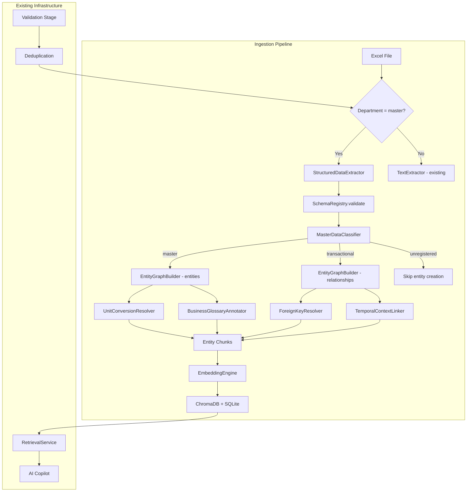
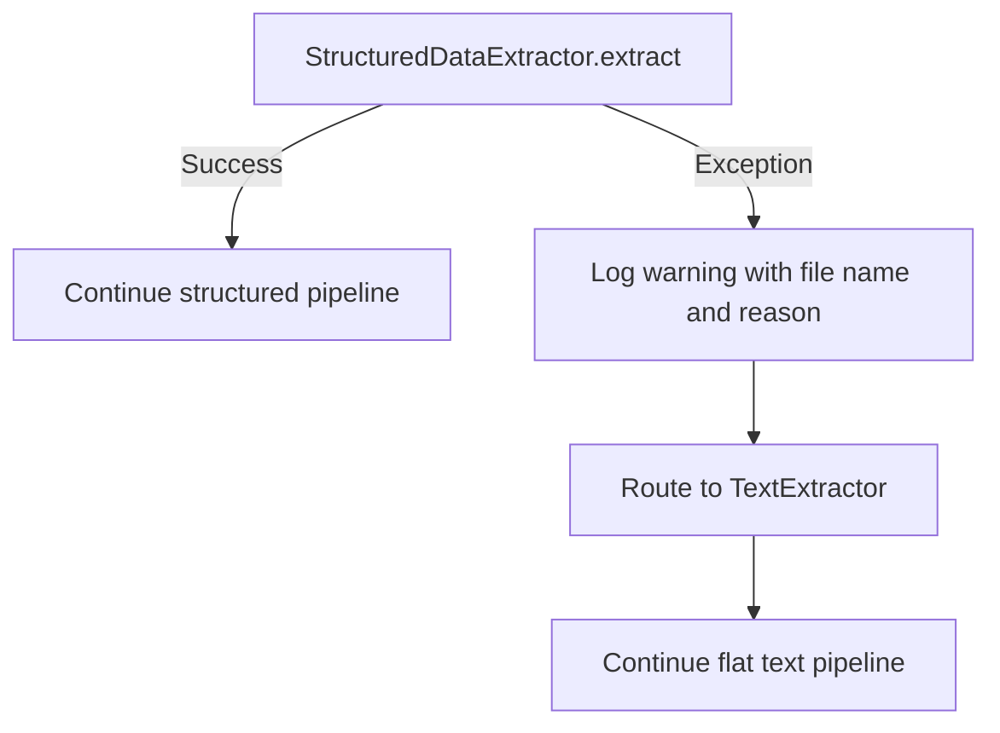

# Design Document: Master Data Ingestion

## Overview

This design introduces a structured data extraction pipeline that transforms multi-sheet Excel workbooks containing JBD branch master and transactional data into a typed knowledge graph. The pipeline replaces the existing flat text extraction (pipe-separated rows) with a schema-aware parser that preserves entity relationships, multi-level unit conversions, business glossary annotations, and temporal context.

The system integrates into the existing `IngestionOrchestrator` pipeline, routing Excel files from the "master" department through a new `StructuredDataExtractor` instead of the flat `TextExtractor`. Extracted entities and relationships are persisted via the existing `GraphRAGEngine` and embedded in ChromaDB for semantic retrieval.

### Key Design Decisions

1. **Schema-driven parsing**: A registry of known sheet schemas (MBarang, MPD, MOutlet, SO, Jual, Beli, Stok) drives column validation and type coercion, while unknown sheets pass through without validation.
2. **Entity-per-record model**: Each master data row becomes a first-class `Entity` in the knowledge graph, keyed by its business primary key (product ID, customer code, supplier code).
3. **Relationship-first transactions**: Transactional rows create relationship edges to master entities rather than standalone entity nodes, preserving the star-schema semantics of the source data.
4. **Graceful degradation**: If structured extraction fails for a file, the orchestrator falls back to the existing flat `TextExtractor`, ensuring no data loss.
5. **Incremental upsert**: Re-ingestion matches by primary key and updates attributes without duplicating entities, supporting monthly data refreshes.

## Architecture



### Pipeline Flow

1. **Validation & Deduplication** (existing): Schema validation, content hash dedup, access rules
2. **Routing**: Files with `department=master` or matching subfolder are routed to `StructuredDataExtractor`
3. **Structured Parsing**: Multi-sheet Excel parsing with type preservation
4. **Schema Validation**: Column presence and type checking against registered schemas
5. **Classification**: Sheets classified as master, transactional, or unregistered
6. **Entity/Relationship Building**: Master records → entities; transactional records → relationship edges
7. **Enrichment**: Unit conversions, business glossary annotations, temporal links
8. **Chunk Generation**: Natural language descriptions per entity for embedding
9. **Embedding & Storage**: Embeddings stored in ChromaDB; entities/relationships in SQLite

## Components and Interfaces

### 1. StructuredDataExtractor

**Location**: `app/services/ingestion/structured_data_extractor.py`

**Responsibility**: Parse multi-sheet Excel workbooks into typed record sets.

```python
@dataclass
class ParsedSheet:
    """A single parsed worksheet."""
    sheet_name: str
    headers: list[str]
    rows: list[dict[str, Any]]  # Each row is {column_name: typed_value}
    row_count: int
    data_types: dict[str, str]  # {column_name: "string"|"numeric"|"date"}

@dataclass
class ParsedWorkbook:
    """Complete parsed workbook output."""
    file_path: str
    sheets: list[ParsedSheet]
    parse_errors: list[str]

class StructuredDataExtractor:
    """Parses Excel workbooks into typed relational structures."""

    MAX_FILE_SIZE_MB: int = 50
    MAX_SHEETS: int = 50
    MAX_ROWS_PER_SHEET: int = 100_000
    MAX_COLS_PER_SHEET: int = 500

    def extract(self, file_path: Path) -> ParsedWorkbook:
        """Parse an Excel file into structured sheet data.
        
        Raises:
            FileSizeExceededError: If file exceeds 50 MB.
            ExcelParseError: If file cannot be opened or has no readable sheets.
        """
        ...

    def _parse_sheet(self, worksheet, sheet_name: str) -> ParsedSheet:
        """Parse a single worksheet into typed records."""
        ...

    def _detect_header_row(self, worksheet) -> tuple[int, list[str]]:
        """Detect header row; auto-generate Column_N if no text header found."""
        ...

    def _infer_data_type(self, values: list[Any]) -> str:
        """Infer column data type from cell values."""
        ...

    def _deduplicate_headers(self, headers: list[str]) -> list[str]:
        """Append numeric suffix to duplicate column names."""
        ...
```

### 2. SchemaRegistry

**Location**: `app/services/ingestion/schema_registry.py`

**Responsibility**: Store and validate expected column schemas for known sheet types.

```python
@dataclass
class ColumnDefinition:
    """Schema definition for a single column."""
    name: str
    required: bool
    data_type: str  # "string" | "numeric" | "date"

@dataclass
class SheetSchema:
    """Complete schema for a known sheet type."""
    sheet_name: str
    columns: list[ColumnDefinition]
    primary_key: str
    foreign_keys: dict[str, str]  # {column_name: "target_sheet.target_column"}
    data_category: str  # "master" | "transactional"

@dataclass
class ValidationResult:
    """Result of schema validation."""
    is_valid: bool
    missing_columns: list[str]
    type_mismatches: list[dict]  # [{column, row, expected, actual}]
    warnings: list[str]

class SchemaRegistry:
    """Stores and validates schemas for known sheet types."""

    def __init__(self) -> None:
        self._schemas: dict[str, SheetSchema] = self._load_default_schemas()

    def get_schema(self, sheet_name: str) -> SheetSchema | None:
        """Look up schema by case-insensitive exact match."""
        ...

    def validate(self, parsed_sheet: ParsedSheet) -> ValidationResult:
        """Validate a parsed sheet against its registered schema."""
        ...

    def _load_default_schemas(self) -> dict[str, SheetSchema]:
        """Load built-in schemas for MBarang, MPD, MOutlet, SO, Jual, Beli, Stok."""
        ...
```

### 3. MasterDataClassifier

**Location**: `app/services/ingestion/master_data_classifier.py`

**Responsibility**: Classify sheets as master, transactional, or unregistered.

```python
@dataclass
class ClassificationResult:
    """Classification output for a parsed sheet."""
    sheet_name: str
    category: str  # "master" | "transactional" | "unregistered"
    schema: SheetSchema | None

class MasterDataClassifier:
    """Classifies parsed sheets by their data category."""

    def __init__(self, schema_registry: SchemaRegistry) -> None:
        self._registry = schema_registry

    def classify(self, parsed_sheet: ParsedSheet) -> ClassificationResult:
        """Classify a sheet based on its schema registry entry."""
        ...
```

### 4. EntityGraphBuilder

**Location**: `app/services/ingestion/entity_graph_builder.py`

**Responsibility**: Create entity nodes from master records and relationship edges from transactional records.

```python
@dataclass
class EntityRecord:
    """An entity to be persisted in the knowledge graph."""
    entity_type: str  # "product" | "supplier" | "outlet"
    primary_key: str
    name: str
    attributes: dict[str, Any]
    glossary_annotations: dict[str, dict]  # {field: {code, definition, language}}
    status: str  # "resolved" | "unresolved"

@dataclass
class RelationshipRecord:
    """A relationship edge to be persisted."""
    source_key: str
    target_key: str
    target_entity_type: str
    relationship_type: str  # "sold_to", "contains_product", etc.
    attributes: dict[str, Any]

@dataclass
class BuildResult:
    """Result of entity/relationship building for a sheet."""
    entities_created: int
    entities_updated: int
    relationships_created: int
    warnings: list[str]

class EntityGraphBuilder:
    """Builds knowledge graph entities and relationships from parsed data."""

    def __init__(self, db: Session) -> None:
        self._db = db

    def build_master_entities(
        self, parsed_sheet: ParsedSheet, schema: SheetSchema
    ) -> BuildResult:
        """Create one entity per master record, keyed by primary key."""
        ...

    def build_transaction_relationships(
        self, parsed_sheet: ParsedSheet, schema: SheetSchema
    ) -> BuildResult:
        """Create relationship edges from transactional records to master entities."""
        ...

    def upsert_entity(self, record: EntityRecord) -> Entity:
        """Insert or update an entity by primary key match."""
        ...

    def create_relationship(self, record: RelationshipRecord) -> EntityRelationship:
        """Create a directed relationship edge."""
        ...

    def resolve_placeholder(self, primary_key: str, entity_type: str, entity: EntityRecord) -> None:
        """Replace an unresolved placeholder with a fully-populated entity."""
        ...
```

### 5. UnitConversionResolver

**Location**: `app/services/ingestion/unit_conversion_resolver.py`

**Responsibility**: Parse multi-level unit hierarchies and create conversion relationship edges.

```python
@dataclass
class ConversionEdge:
    """A unit conversion relationship."""
    product_key: str
    from_unit: str
    to_unit: str
    conversion_factor: float  # >= 1.0

class UnitConversionResolver:
    """Resolves multi-level unit conversion hierarchies from MBarang records."""

    def resolve(self, product_row: dict[str, Any], product_key: str) -> list[ConversionEdge]:
        """Parse SatB/Berisi1/SatT/Berisi2/SatK fields into conversion edges.
        
        Returns empty list if:
        - All units are identical with factor 1 (single-unit product)
        - Unit fields are missing/empty
        - Conversion factors are zero or negative
        """
        ...

    def compute_equivalent(
        self, quantity: float, from_unit: str, to_unit: str, edges: list[ConversionEdge]
    ) -> float | None:
        """Compute equivalent quantity at a different unit level by traversing edges."""
        ...
```

### 6. BusinessGlossaryAnnotator

**Location**: `app/services/ingestion/business_glossary_annotator.py`

**Responsibility**: Attach business definitions to coded field values.

```python
@dataclass
class GlossaryEntry:
    """A business glossary definition."""
    code: str
    full_name: str
    language: str  # "id" (Indonesian) or "en" (English)

class BusinessGlossaryAnnotator:
    """Annotates entities and relationships with business glossary definitions."""

    GLOSSARY: dict[str, GlossaryEntry] = {
        "PraSO": GlossaryEntry("PraSO", "Pre-Sales Order", "en"),
        "SO": GlossaryEntry("SO", "Sales Order", "en"),
        "J": GlossaryEntry("J", "Jual (Sales)", "id"),
        "RJ": GlossaryEntry("RJ", "Retur Jual (Sales Return)", "id"),
        "NO-SO": GlossaryEntry("NO-SO", "Pre-Sales Order not converted to Sales Order", "en"),
        "SatB": GlossaryEntry("SatB", "Satuan Besar (Big Unit)", "id"),
        "SatT": GlossaryEntry("SatT", "Satuan Tengah (Medium Unit)", "id"),
        "SatK": GlossaryEntry("SatK", "Satuan Kecil (Small Unit)", "id"),
        "CS": GlossaryEntry("CS", "Case", "en"),
        "BTL": GlossaryEntry("BTL", "Bottle", "en"),
        "PPN": GlossaryEntry("PPN", "Pajak Pertambahan Nilai (Value Added Tax)", "id"),
        "DPP": GlossaryEntry("DPP", "Dasar Pengenaan Pajak (Tax Base)", "id"),
    }

    def annotate(self, record: dict[str, Any]) -> dict[str, dict]:
        """Return glossary annotations for all matching field values in a record."""
        ...
```

### 7. TemporalContextLinker

**Location**: `app/services/ingestion/temporal_context_linker.py`

**Responsibility**: Establish time-based relationships between transactional records.

```python
@dataclass
class TemporalRelationship:
    """A time-based relationship between entities."""
    source_key: str
    target_key: str
    relationship_type: str  # "converted_to_so", "fulfilled_by", "stock_as_of"
    attributes: dict[str, Any]  # timestamps, status, etc.

class TemporalContextLinker:
    """Creates temporal relationships between transactional entities."""

    def __init__(self, db: Session) -> None:
        self._db = db

    def link_so_conversions(self, so_rows: list[dict[str, Any]]) -> list[TemporalRelationship]:
        """Create PraSO → SO conversion relationships."""
        ...

    def link_invoice_fulfillment(self, jual_rows: list[dict[str, Any]]) -> list[TemporalRelationship]:
        """Create PraSO → Invoice fulfillment relationships."""
        ...

    def link_stock_snapshots(self, stok_rows: list[dict[str, Any]]) -> list[TemporalRelationship]:
        """Create stock_as_of relationships from stock snapshots."""
        ...
```

### 8. EntityChunkGenerator

**Location**: `app/services/ingestion/entity_chunk_generator.py`

**Responsibility**: Generate natural language descriptions of entities for embedding.

```python
class EntityChunkGenerator:
    """Generates natural language chunks from structured entities."""

    def generate_product_chunk(self, entity: EntityRecord, conversions: list[ConversionEdge]) -> str:
        """Generate embedding text for a product entity.
        
        Example: "Fortune Margarine 15k is a product supplied by SARI AGROTAMA PERSADA D, 
        sold in cases at price 182680.77"
        """
        ...

    def generate_supplier_chunk(self, entity: EntityRecord) -> str:
        """Generate embedding text for a supplier entity."""
        ...

    def generate_outlet_chunk(self, entity: EntityRecord) -> str:
        """Generate embedding text for an outlet entity."""
        ...

    def generate_transaction_summary(
        self, sheet_name: str, period: str, rows: list[dict], linked_entities: dict
    ) -> str:
        """Generate embedding text for a transactional summary."""
        ...
```

## Data Models

### Extended Entity Model

The existing `Entity` model is reused with the following conventions for structured master data:

| Field | Usage for Master Data |
|-------|----------------------|
| `name` | Human-readable entity name (product name, outlet name, supplier name) |
| `normalized_name` | Primary key value (product ID, custcode, suplcode) for deduplication |
| `entity_type` | One of: "product", "supplier", "outlet", "salesman", "praso" |
| `description` | Natural language description including key attributes and glossary annotations |
| `source_chunk_ids` | References to generated entity chunks |

### Extended EntityRelationship Model

The existing `EntityRelationship` model is extended with a new `relationship_type` field via a migration:

```python
class EntityRelationship(Base):
    __tablename__ = "entity_relationships"

    id = Column(Integer, primary_key=True, autoincrement=True)
    source_entity_id = Column(Integer, ForeignKey("entities.id"), nullable=False, index=True)
    target_entity_id = Column(Integer, ForeignKey("entities.id"), nullable=False, index=True)
    description = Column(String(2000), nullable=True)
    strength = Column(Float, nullable=False, default=0.5)
    source_chunk_id = Column(Integer, ForeignKey("chunks.id"), nullable=False)
    # New fields for structured data
    relationship_type = Column(String(64), nullable=True, index=True)  # "sold_to", "contains_product", etc.
    attributes = Column(JSON, nullable=True)  # Temporal data, conversion factors, etc.
```

### Schema Registry Data Structure

Stored as a Python module constant (no database table needed for the initial 7 sheet types):

```python
REGISTERED_SCHEMAS = {
    "mbarang": SheetSchema(
        sheet_name="MBarang",
        columns=[
            ColumnDefinition("ID", required=True, data_type="string"),
            ColumnDefinition("Nama", required=True, data_type="string"),
            ColumnDefinition("HargaJual", required=False, data_type="numeric"),
            ColumnDefinition("VendorCode", required=False, data_type="string"),
            ColumnDefinition("SatB", required=False, data_type="string"),
            ColumnDefinition("Berisi1", required=False, data_type="numeric"),
            ColumnDefinition("SatT", required=False, data_type="string"),
            ColumnDefinition("Berisi2", required=False, data_type="numeric"),
            ColumnDefinition("SatK", required=False, data_type="string"),
            # ... additional columns
        ],
        primary_key="ID",
        foreign_keys={},
        data_category="master",
    ),
    "mpd": SheetSchema(
        sheet_name="MPD",
        columns=[
            ColumnDefinition("suplcode", required=True, data_type="string"),
            ColumnDefinition("suplname", required=True, data_type="string"),
            ColumnDefinition("address", required=False, data_type="string"),
            ColumnDefinition("city", required=False, data_type="string"),
            ColumnDefinition("email", required=False, data_type="string"),
            ColumnDefinition("blocked", required=False, data_type="string"),
        ],
        primary_key="suplcode",
        foreign_keys={},
        data_category="master",
    ),
    "moutlet": SheetSchema(
        sheet_name="MOutlet",
        columns=[
            ColumnDefinition("custcode", required=True, data_type="string"),
            ColumnDefinition("custname", required=True, data_type="string"),
            ColumnDefinition("outlettype", required=False, data_type="string"),
            ColumnDefinition("address", required=False, data_type="string"),
            ColumnDefinition("area", required=False, data_type="string"),
            ColumnDefinition("contactperson", required=False, data_type="string"),
        ],
        primary_key="custcode",
        foreign_keys={},
        data_category="master",
    ),
    "so": SheetSchema(
        sheet_name="SO",
        columns=[
            ColumnDefinition("SO_No", required=True, data_type="string"),
            ColumnDefinition("Outlet_ID", required=True, data_type="string"),
            ColumnDefinition("SKU_ID", required=True, data_type="string"),
            ColumnDefinition("PraSO_Code", required=False, data_type="string"),
            ColumnDefinition("PraSO_Date", required=False, data_type="date"),
            ColumnDefinition("SO_Date", required=False, data_type="date"),
            ColumnDefinition("Status", required=False, data_type="string"),
        ],
        primary_key="SO_No",
        foreign_keys={"Outlet_ID": "MOutlet.custcode", "SKU_ID": "MBarang.ID"},
        data_category="transactional",
    ),
    "jual": SheetSchema(
        sheet_name="Jual",
        columns=[
            ColumnDefinition("Invoice_No", required=True, data_type="string"),
            ColumnDefinition("Outlet_ID", required=True, data_type="string"),
            ColumnDefinition("SKU", required=True, data_type="string"),
            ColumnDefinition("Sales_ID", required=False, data_type="string"),
            ColumnDefinition("PrincID", required=False, data_type="string"),
            ColumnDefinition("PraSO_Ref", required=False, data_type="string"),
            ColumnDefinition("Qty", required=False, data_type="numeric"),
            ColumnDefinition("Amount", required=False, data_type="numeric"),
        ],
        primary_key="Invoice_No",
        foreign_keys={
            "Outlet_ID": "MOutlet.custcode",
            "SKU": "MBarang.ID",
            "Sales_ID": "Salesman.id",
            "PrincID": "MPD.suplcode",
        },
        data_category="transactional",
    ),
    "beli": SheetSchema(
        sheet_name="Beli",
        columns=[
            ColumnDefinition("PO_No", required=True, data_type="string"),
            ColumnDefinition("Principal", required=True, data_type="string"),
            ColumnDefinition("SKU", required=True, data_type="string"),
            ColumnDefinition("Qty", required=False, data_type="numeric"),
            ColumnDefinition("Amount", required=False, data_type="numeric"),
        ],
        primary_key="PO_No",
        foreign_keys={"Principal": "MPD.suplcode", "SKU": "MBarang.ID"},
        data_category="transactional",
    ),
    "stok": SheetSchema(
        sheet_name="Stok",
        columns=[
            ColumnDefinition("Itemcode", required=True, data_type="string"),
            ColumnDefinition("Qty", required=False, data_type="numeric"),
            ColumnDefinition("Timestamp", required=False, data_type="date"),
        ],
        primary_key="Itemcode",
        foreign_keys={"Itemcode": "MBarang.ID"},
        data_category="transactional",
    ),
}
```

### ChromaDB Metadata Schema

Entity embeddings are stored with the following metadata tags:

```python
{
    "entity_type": "product" | "supplier" | "outlet",
    "department": "master",
    "source_file": "Master for Project AI JBD.xlsx",
    "primary_key": "PRD001",
    "data_category": "master" | "transactional",
}
```

## Correctness Properties

*A property is a characteristic or behavior that should hold true across all valid executions of a system — essentially, a formal statement about what the system should do. Properties serve as the bridge between human-readable specifications and machine-verifiable correctness guarantees.*

### Property 1: Parsing round-trip (serialization identity)

*For any* valid `ParsedWorkbook` structure, serializing it to JSON and deserializing back SHALL produce a structure with identical sheet names, column headers, row count, cell values, and data types.

**Validates: Requirements 1.4**

### Property 2: Header uniqueness after deduplication

*For any* sheet with a header row containing duplicate column names, the `StructuredDataExtractor` SHALL produce output headers that are all unique (no two headers are equal), and the count of output headers equals the count of input columns.

**Validates: Requirements 1.2**

### Property 3: Empty row/column filtering preserves data region

*For any* sheet with interspersed blank rows and columns, the parsed output SHALL contain exactly the cells from the contiguous rectangular region bounded by the first and last non-empty cells, with no fully-blank rows or columns in the output.

**Validates: Requirements 1.3**

### Property 4: Auto-generated headers for numeric-only first rows

*For any* sheet where the first non-empty row contains only numeric values, the `StructuredDataExtractor` SHALL assign headers matching the pattern `Column_1, Column_2, ..., Column_N` where N equals the column count, and all rows (including the first) SHALL be treated as data rows.

**Validates: Requirements 1.6**

### Property 5: Schema validation identifies all missing required columns

*For any* parsed sheet matching a registered schema, the `SchemaRegistry` validation result SHALL list exactly the set of required columns that are absent from the parsed sheet headers (case-insensitive comparison), and the validation SHALL proceed with partial ingestion of present columns.

**Validates: Requirements 2.2, 2.3**

### Property 6: Unregistered sheets bypass validation and entity creation

*For any* sheet name that does not match any registered schema name (case-insensitive), the system SHALL classify it as "unregistered", apply no column or type validation, and create no entities or relationships for that sheet.

**Validates: Requirements 2.4, 3.5**

### Property 7: Type mismatch detection preserves raw values

*For any* column value in a registered sheet that does not conform to the expected data type, the `SchemaRegistry` SHALL flag it as a type mismatch in the validation result AND the raw value SHALL be preserved as-is in the parsed output.

**Validates: Requirements 2.6**

### Property 8: Classification correctness for registered sheets

*For any* parsed sheet whose name matches a registered schema entry (case-insensitive), the `MasterDataClassifier` SHALL assign the classification equal to the `data_category` attribute defined in that schema entry, and attach the classification as metadata to the output.

**Validates: Requirements 3.1, 3.6**

### Property 9: Master entity creation with primary key deduplication

*For any* master sheet with N records having non-null, non-empty primary keys, the `EntityGraphBuilder` SHALL create exactly N entities where each entity's `normalized_name` equals the record's primary key value, and each entity contains all schema-defined attributes for its entity type (product: ID, name, price, vendor, dimensions, company; supplier: code, name, address, city, email, blocked; outlet: code, name, type, address, area, contact).

**Validates: Requirements 3.2, 4.1, 4.2, 4.3, 4.4**

### Property 10: Entity upsert idempotence

*For any* master entity with a given primary key, if an entity with that key already exists in the knowledge graph, re-ingestion SHALL update the existing entity's attributes to match the new record and SHALL NOT increase the total entity count.

**Validates: Requirements 4.5**

### Property 11: Unit conversion edge creation (3-level hierarchy)

*For any* MBarang record with valid, distinct unit names (SatB ≠ SatT ≠ SatK) and positive conversion factors (Berisi1 ≥ 1, Berisi2 ≥ 1), the `UnitConversionResolver` SHALL create exactly two conversion edges: (SatB → SatT, factor=Berisi1) and (SatT → SatK, factor=Berisi2), each with conversion_factor ≥ 1.

**Validates: Requirements 5.1, 5.2**

### Property 12: Unit conversion round-trip

*For any* product with a valid 3-level unit hierarchy, converting a quantity from unit A to unit B and back to unit A SHALL produce the original quantity (within floating-point tolerance).

**Validates: Requirements 5.3**

### Property 13: Single-unit products create no conversion edges

*For any* MBarang record where all unit names are identical (SatB = SatT = SatK) and all conversion factors equal 1, the `UnitConversionResolver` SHALL create zero conversion edges and SHALL set a single-unit attribute on the product entity.

**Validates: Requirements 5.4**

### Property 14: Foreign key relationship count invariant

*For any* transactional record row, the number of relationship edges created SHALL equal exactly the number of non-null foreign key fields present in that record, with each edge having the correct relationship type label as defined in the schema.

**Validates: Requirements 6.1, 6.2, 6.5**

### Property 15: Unresolved foreign keys create placeholder entities

*For any* foreign key value in a transactional record that does not match any existing master entity, the `EntityGraphBuilder` SHALL create a placeholder entity of the expected target type with status "unresolved", and the relationship edge SHALL still be created pointing to that placeholder.

**Validates: Requirements 6.3**

### Property 16: Placeholder resolution preserves relationships

*For any* placeholder entity marked "unresolved", when a master entity is ingested with a matching primary key, the placeholder SHALL be replaced with the fully-populated entity and all existing relationship edges referencing it SHALL be preserved (edge count unchanged).

**Validates: Requirements 6.4**

### Property 17: Glossary annotation completeness

*For any* record, every field value that exactly matches a glossary key SHALL have a glossary annotation attached (containing code, full_name, and language), and every field value that does not match any glossary key SHALL have no glossary annotation for that field.

**Validates: Requirements 7.2, 7.3**

### Property 18: Temporal SO conversion linking

*For any* SO record with both PraSO_Code/PraSO_Date and SO_No/SO_Date fields populated and status ≠ "NO-SO", the `TemporalContextLinker` SHALL create exactly one "converted_to_so" relationship from the PraSO entity to the SO entity with both dates as attributes.

**Validates: Requirements 8.1**

### Property 19: NO-SO status prevents conversion relationship

*For any* SO record with status "NO-SO", the `TemporalContextLinker` SHALL NOT create a "converted_to_so" relationship and SHALL set the PraSO entity's conversion_status to "unconverted".

**Validates: Requirements 8.5**

### Property 20: Invoice fulfillment linking

*For any* Jual record with a non-null PraSO_Ref field, the `TemporalContextLinker` SHALL create exactly one "fulfilled_by" relationship from the referenced PraSO entity to the invoice entity.

**Validates: Requirements 8.2**

### Property 21: Stock snapshot temporal linking

*For any* Stok record with a non-null timestamp and valid Itemcode, the `TemporalContextLinker` SHALL create a "stock_as_of" relationship from the stock snapshot to the product entity with the timestamp as a relationship attribute.

**Validates: Requirements 8.4**

### Property 22: Entity chunk contains required attributes

*For any* master entity, the generated natural language chunk SHALL contain: for products — ID, name, supplier name, unit of sale, and selling price; for suppliers — code, name, and city; for outlets — code, name, type, and area.

**Validates: Requirements 9.2, 10.1**

### Property 23: Transactional summary contains required fields

*For any* transactional summary chunk, the generated natural language text SHALL contain the transaction period (month/year), transaction type, total quantity, total monetary amount, and names of linked master entities.

**Validates: Requirements 10.2**

### Property 24: Incremental ingestion preserves absent entities

*For any* re-ingestion of a master data file, entities whose primary keys are present in the existing graph but absent from the new file SHALL be retained without modification (entity count for those keys unchanged, attributes unchanged).

**Validates: Requirements 11.1**

### Property 25: Additive transactional ingestion

*For any* new-period transactional file ingestion, all relationship edges from previously ingested periods SHALL remain in the graph (previous period relationship count unchanged).

**Validates: Requirements 11.2**

### Property 26: Failed re-ingestion rollback

*For any* file re-ingestion that fails after partial processing, the knowledge graph SHALL be in its pre-ingestion state for that file (no new entities, no updated attributes, no new relationships from that file).

**Validates: Requirements 11.5**

### Property 27: Stage log accuracy

*For any* completed structured extraction, the IngestionStageLog details SHALL contain integer fields `sheets_parsed`, `records_extracted`, `entities_created`, and `relationships_created` whose values match the actual counts produced during processing.

**Validates: Requirements 9.4, 11.6**

## Error Handling

### Error Categories

| Error | Source | Handling | Recovery |
|-------|--------|----------|----------|
| `FileSizeExceededError` | StructuredDataExtractor | Reject file, return error with size info | User re-uploads smaller file |
| `ExcelParseError` | StructuredDataExtractor | Log error, fall back to TextExtractor | Flat text extraction continues |
| Missing required columns | SchemaRegistry | Return validation warnings, proceed with partial data | Partial ingestion with available columns |
| Type mismatch | SchemaRegistry | Flag in validation result, use raw value | Ingestion continues with raw values |
| Null/empty primary key | EntityGraphBuilder | Skip record, log warning with sheet/row | Other records processed normally |
| Invalid conversion factor | UnitConversionResolver | Skip conversion edges, log warning | Product entity created without conversions |
| Unresolved foreign key | EntityGraphBuilder | Create placeholder entity, log warning | Placeholder resolved on future ingestion |
| Embedding failure | EmbeddingEngine | Log warning, skip entity embedding | Entity persisted without embedding |
| Partial re-ingestion failure | EntityGraphBuilder | Rollback all changes for that file | Graph remains in pre-ingestion state |

### Fallback Strategy



### Transaction Boundaries

- Each file's ingestion is wrapped in a database transaction
- On failure after partial processing, all entity/relationship changes for that file are rolled back
- The `IngestionOrchestrator` commits only after all entities and relationships for a file are successfully created
- ChromaDB upserts happen after SQLite commits to maintain consistency (SQLite is source of truth)

## Testing Strategy

### Property-Based Testing (Hypothesis)

The project already uses `hypothesis==6.112.1` for property-based testing. Each correctness property above maps to a property-based test with minimum 100 iterations.

**Library**: [Hypothesis](https://hypothesis.readthedocs.io/) (already in dev dependencies)

**Configuration**:
- Minimum 100 examples per property test (`@settings(max_examples=100)`)
- Each test tagged with: `# Feature: master-data-ingestion, Property N: <property_text>`
- Test file: `tests/test_master_data_ingestion_properties.py`

**Key Generators**:
- `parsed_workbook()` — generates random `ParsedWorkbook` instances with varying sheet counts, row counts, and data types
- `master_record(sheet_type)` — generates random master records conforming to a given schema
- `transactional_record(sheet_type)` — generates random transactional records with valid/invalid FK references
- `unit_hierarchy()` — generates random 3-level unit hierarchies with valid/invalid factors
- `glossary_record()` — generates records with random mixtures of glossary and non-glossary field values

### Unit Tests (pytest)

**File**: `tests/test_master_data_ingestion.py`

Focus areas:
- Specific examples for each entity type (MBarang, MPD, MOutlet)
- Edge cases: empty files, corrupted files, 50 MB boundary
- Integration: orchestrator routing, fallback behavior, stage logging
- Schema registry: all 7 registered schemas present with correct definitions

### Integration Tests

**File**: `tests/test_master_data_ingestion_integration.py`

Focus areas:
- End-to-end ingestion of actual Excel files from `knowledge_base/master/`
- ChromaDB embedding storage and retrieval
- Orchestrator fallback from structured to flat extraction
- Pipeline ordering (validation → dedup → structured extraction)
- Retrieval service returns entities with graph neighborhood

### Test Organization

```
tests/
├── test_master_data_ingestion_properties.py   # Property-based tests (27 properties)
├── test_master_data_ingestion.py              # Unit tests and edge cases
└── test_master_data_ingestion_integration.py  # Integration tests
```

