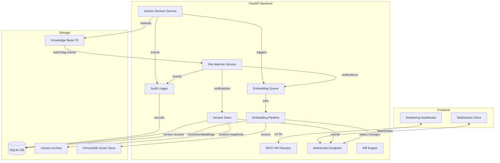
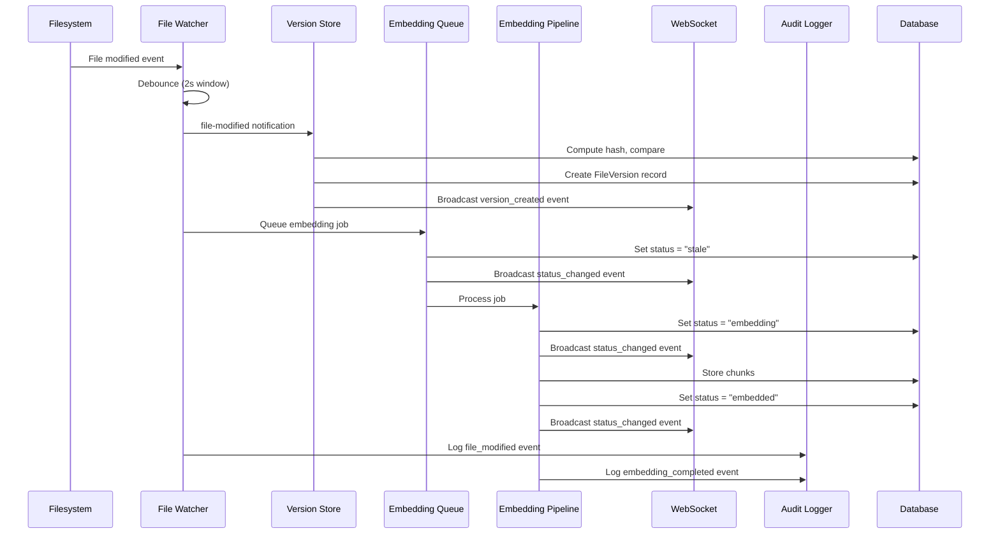
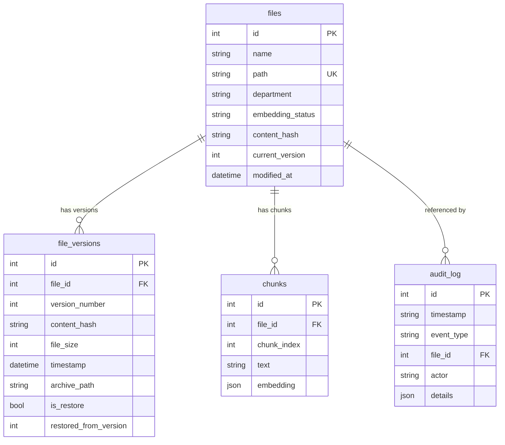

# Design Document: Real-Time Embedding Versioning

## Overview

This design introduces a real-time file monitoring, automatic re-embedding, and version management system for the Executive Copilot knowledge base. The system extends the existing FastAPI backend with:

1. **File Watcher Service** — Uses `watchdog` to monitor the knowledge base directory for filesystem events, debounces rapid changes, and emits typed notifications.
2. **Embedding Pipeline Queue** — An async task queue that processes embedding jobs triggered by file changes, with configurable concurrency and retry logic.
3. **Version Store** — A new `FileVersion` model and service that stores complete version history with content snapshots and hash-based deduplication.
4. **Diff Engine** — Computes line-level text diffs between any two versions of a file using Python's `difflib`.
5. **Version Restore Service** — Restores historical versions and triggers re-embedding automatically.
6. **WebSocket Communication** — A FastAPI WebSocket endpoint (`/ws/embedding-status`) that streams real-time events to the frontend.
7. **Audit Logger** — A dedicated `audit_log` table and service recording all system actions with ISO 8601 timestamps.
8. **Monitoring Dashboard** — A new React page displaying file status, version history, diff views, and a real-time activity feed.

The design builds on existing infrastructure (SQLAlchemy ORM, `File` model, `EmbeddingEngine`, `SyncEngine`) and extends it without breaking existing functionality.

## Architecture

### High-Level System Architecture



### Component Interaction Sequence (File Modification)



## Components and Interfaces

### 1. File Watcher Service (`backend/app/services/file_watcher.py`)

**Responsibility:** Monitors the knowledge base directory for filesystem events using `watchdog`, debounces rapid changes, and dispatches typed notifications to subscribers.

**Interface:**

```python
from dataclasses import dataclass
from datetime import datetime
from enum import Enum
from typing import Callable, Awaitable

class FileEventType(Enum):
    CREATED = "file_created"
    MODIFIED = "file_modified"
    DELETED = "file_deleted"

@dataclass
class FileNotification:
    event_type: FileEventType
    file_path: str           # Relative to knowledge base root
    file_size: int | None    # None for deletions
    content_hash: str | None # None for deletions
    timestamp: datetime      # UTC detection timestamp

EventHandler = Callable[[FileNotification], Awaitable[None]]

class FileWatcherService:
    def __init__(self, kb_path: str, debounce_seconds: float = 2.0, max_depth: int = 10):
        ...

    def subscribe(self, handler: EventHandler) -> None:
        """Register an async handler for file notifications."""
        ...

    async def start(self) -> None:
        """Start watching the filesystem. Performs initial reconciliation."""
        ...

    async def stop(self) -> None:
        """Stop watching and clean up resources."""
        ...

    async def reconcile(self) -> list[FileNotification]:
        """Full filesystem reconciliation against DB state."""
        ...
```

**Design Decisions:**
- Uses `watchdog.observers.Observer` with a custom `FileSystemEventHandler` subclass.
- Debouncing is per-file using an `asyncio.Task` dictionary keyed by file path; if a new event arrives within the 2-second window, the existing task is cancelled and restarted.
- Reconciliation on startup uses the same `_scan_filesystem` pattern as `SyncEngine` but emits `FileNotification` objects for each discrepancy.
- Maximum directory depth is enforced by filtering events whose path depth exceeds `max_depth`.
- Reconnection on filesystem errors uses exponential backoff (1s → 60s max).

### 2. Embedding Queue Service (`backend/app/services/embedding_queue.py`)

**Responsibility:** Manages a FIFO queue of embedding jobs with configurable concurrency, deduplication, and cancellation of superseded jobs.

**Interface:**

```python
from dataclasses import dataclass
from enum import Enum

class JobStatus(Enum):
    QUEUED = "queued"
    PROCESSING = "processing"
    COMPLETED = "completed"
    FAILED = "failed"
    CANCELLED = "cancelled"

@dataclass
class EmbeddingJob:
    file_id: int
    file_path: str
    content_hash: str
    retry_count: int = 0
    max_retries: int = 3
    status: JobStatus = JobStatus.QUEUED

class EmbeddingQueueService:
    def __init__(self, concurrency: int = 3, max_concurrency: int = 10):
        ...

    async def enqueue(self, file_id: int, file_path: str, content_hash: str) -> None:
        """Add a file to the embedding queue. Cancels existing jobs for same file."""
        ...

    async def cancel_file(self, file_id: int) -> None:
        """Cancel any queued/processing job for the given file."""
        ...

    async def start(self) -> None:
        """Start processing the queue with configured concurrency."""
        ...

    async def stop(self) -> None:
        """Gracefully stop processing after current jobs complete."""
        ...

    def get_queue_status(self) -> dict:
        """Return counts by status: queued, processing, completed, failed."""
        ...
```

**Design Decisions:**
- Uses `asyncio.Queue` for FIFO ordering with `asyncio.Semaphore` for concurrency control.
- Job deduplication: when a new job arrives for a file already queued/processing, the old job is marked `CANCELLED` and removed/stopped.
- Retry logic: failed jobs are retried up to 3 times with exponential backoff (5s, 15s, 45s) before being marked permanently failed.
- The queue processes jobs by calling into the existing `EmbeddingEngine.run_single()` method.

### 3. Version Store Service (`backend/app/services/version_store.py`)

**Responsibility:** Manages file version history, stores content snapshots, enforces size limits, and provides version retrieval.

**Interface:**

```python
from dataclasses import dataclass
from datetime import datetime

@dataclass
class VersionInfo:
    version_number: int
    content_hash: str
    file_size: int
    timestamp: datetime
    is_restore: bool = False
    restored_from_version: int | None = None

class VersionStoreService:
    def __init__(self, db: Session, archive_dir: str):
        ...

    def create_version(self, file_id: int, file_path: str, content: bytes) -> VersionInfo | None:
        """Create a new version if content hash differs. Returns None if duplicate."""
        ...

    def create_restore_version(self, file_id: int, file_path: str, content: bytes, restored_from: int) -> VersionInfo:
        """Create a version record with restore indicator."""
        ...

    def get_versions(self, file_id: int, page: int = 1, page_size: int = 50) -> list[VersionInfo]:
        """Get version history for a file, ordered by version_number desc."""
        ...

    def get_version_content(self, file_id: int, version_number: int) -> bytes:
        """Retrieve stored content for a specific version."""
        ...

    def get_latest_version(self, file_id: int) -> VersionInfo | None:
        """Get the latest version record for a file."""
        ...
```

**Design Decisions:**
- Content snapshots are stored in a version archive directory (`{kb_path}/.versions/{file_id}/{version_number}`) rather than in the database, to avoid bloating SQLite.
- Content hashing uses MD5 (consistent with existing `content_hash` field on `File` model).
- Version numbers are monotonically increasing per file, assigned via a `SELECT MAX(version_number)` query + 1 within a transaction.
- 500 MB file size limit enforced before content is written.
- Integrity verification: after writing content to archive, re-hash and compare. Delete on mismatch.

### 4. Diff Engine (`backend/app/services/diff_engine.py`)

**Responsibility:** Computes line-level textual differences between two file versions.

**Interface:**

```python
from dataclasses import dataclass

@dataclass
class DiffOperation:
    operation: str    # "addition", "deletion", "modification"
    line_number: int
    content: str
    old_content: str | None = None  # For modifications

@dataclass
class DiffSummary:
    lines_added: int
    lines_deleted: int
    lines_modified: int

@dataclass
class DiffResult:
    operations: list[DiffOperation]
    summary: DiffSummary

class DiffEngine:
    def __init__(self, text_extractor: TextExtractor, version_store: VersionStoreService):
        ...

    def compute_diff(self, file_id: int, version_a: int, version_b: int) -> DiffResult:
        """Compute line-level diff between two versions of a file."""
        ...
```

**Design Decisions:**
- Uses Python's `difflib.unified_diff` for diff computation, then parses the output into structured `DiffOperation` objects.
- For non-text files (PDF, DOCX, Excel), extracts text using the existing `TextExtractor` service before diffing.
- 30-second timeout enforced for large files via signal-based timeout on POSIX or thread-based on Windows.

### 5. Version Restore Service (`backend/app/services/version_restore.py`)

**Responsibility:** Restores a specific historical version of a file to the filesystem and triggers re-embedding.

**Interface:**

```python
class VersionRestoreService:
    def __init__(self, db: Session, version_store: VersionStoreService,
                 embedding_queue: EmbeddingQueueService, audit_logger: AuditLogger,
                 kb_path: str):
        ...

    async def restore_version(self, file_id: int, version_number: int, actor: str) -> VersionInfo:
        """Restore a file to a specific version. Creates a new version record with restore indicator."""
        ...
```

**Design Decisions:**
- Writes content atomically (write to temp file, then `os.replace`) to prevent partial writes.
- On failure, any partial temp files are cleaned up and the current file is left unchanged.
- Creates a new `FileVersion` record with `is_restore=True` and `restored_from_version` set.
- Triggers re-embedding via the embedding queue immediately after successful restore.
- Validates: file exists, version exists, file not deleted.

### 6. WebSocket Manager (`backend/app/services/websocket_manager.py`)

**Responsibility:** Manages WebSocket connections, broadcasts events, handles reconnection state, and sends missed events.

**Interface:**

```python
from dataclasses import dataclass
from datetime import datetime
from enum import Enum

class WSEventType(Enum):
    STATUS_CHANGED = "status_changed"
    VERSION_CREATED = "version_created"
    EMBEDDING_PROGRESS = "embedding_progress"
    ACTIVITY_EVENT = "activity_event"
    INITIAL_STATE = "initial_state"

@dataclass
class WSEvent:
    event_type: WSEventType
    payload: dict
    timestamp: datetime

class WebSocketManager:
    def __init__(self, max_event_buffer: int = 100):
        ...

    async def connect(self, websocket: WebSocket) -> None:
        """Accept connection and send initial state snapshot."""
        ...

    async def disconnect(self, websocket: WebSocket) -> None:
        """Remove connection from active set."""
        ...

    async def broadcast(self, event: WSEvent) -> None:
        """Send event to all connected clients. Buffer for reconnection."""
        ...

    async def send_missed_events(self, websocket: WebSocket, last_event_id: str) -> None:
        """Send events missed during disconnection (up to 100)."""
        ...
```

**Design Decisions:**
- Uses FastAPI's native WebSocket support; endpoint at `/ws/embedding-status`.
- Maintains a ring buffer of the last 100 events for reconnection replay.
- Each event gets a monotonically increasing ID; clients send their last seen ID on reconnect.
- Initial state snapshot includes: embedding status counts and last 50 activity events.
- Connection drops are detected via WebSocket ping/pong with 30s timeout.

### 7. Audit Logger (`backend/app/services/audit_logger.py`)

**Responsibility:** Records all system actions with ISO 8601 timestamps (millisecond precision), event types, and actor identifiers.

**Interface:**

```python
from enum import Enum

class AuditEventType(Enum):
    FILE_CREATED = "file_created"
    FILE_MODIFIED = "file_modified"
    FILE_DELETED = "file_deleted"
    EMBEDDING_STARTED = "embedding_started"
    EMBEDDING_COMPLETED = "embedding_completed"
    EMBEDDING_FAILED = "embedding_failed"
    VERSION_CREATED = "version_created"
    VERSION_RESTORED = "version_restored"
    SYSTEM_ERROR = "system_error"

class AuditLogger:
    def __init__(self, db: Session):
        ...

    def log(self, event_type: AuditEventType, file_id: int | None,
            actor: str = "system", details: dict | None = None) -> None:
        """Record an audit event with UTC timestamp."""
        ...

    def get_recent_events(self, limit: int = 50) -> list[AuditLog]:
        """Get most recent audit events for activity feed."""
        ...
```

**Design Decisions:**
- Actor is either a user ID string or `"system"` for automated actions.
- Timestamps stored as ISO 8601 with millisecond precision.
- 90-day retention policy enforced via periodic cleanup (configurable).
- Writes are fire-and-forget (non-blocking) to avoid slowing the main pipeline.

### 8. REST API Routers

**New Router: `backend/app/routers/monitoring.py`**

| Endpoint | Method | Description |
|----------|--------|-------------|
| `/api/monitoring/files` | GET | Paginated file list with status, version, modified_at |
| `/api/monitoring/files/{file_id}/versions` | GET | Version history for a file |
| `/api/monitoring/files/{file_id}/versions/diff` | POST | Diff between two versions |
| `/api/monitoring/files/{file_id}/versions/{version}/restore` | POST | Restore a version |
| `/api/monitoring/embedding-status` | GET | Current embedding status counts |
| `/api/monitoring/activity` | GET | Recent activity events |
| `/ws/embedding-status` | WS | WebSocket for real-time updates |

### 9. Frontend Monitoring Dashboard (`frontend/src/app/components/MonitoringDashboard/`)

**Component Structure:**

```
MonitoringDashboard/
├── index.tsx                    # Main page component with layout
├── FileStatusTable.tsx          # Paginated file list with status badges
├── EmbeddingProgressBar.tsx     # Summary counts (pending/embedding/failed/embedded)
├── VersionHistoryPanel.tsx      # Version list for selected file
├── DiffViewer.tsx               # Side-by-side or unified diff display
├── RestoreDialog.tsx            # Confirmation dialog for version restore
├── ActivityFeed.tsx             # Real-time event stream
├── ConnectionIndicator.tsx     # WebSocket connection status
└── hooks/
    ├── useWebSocket.ts          # WebSocket connection with auto-reconnect
    ├── useMonitoringData.ts     # REST API data fetching
    └── useVersionDiff.ts        # Diff request hook
```

**Design Decisions:**
- Uses existing MUI + Radix UI component patterns from the project.
- WebSocket hook implements exponential backoff (1s → 30s, max 10 retries).
- Data fetching uses `axios` (already in project dependencies).
- Recharts (already in dependencies) for embedding progress visualization.
- React Router integration for navigation to the monitoring page.

## Data Models

### New Model: `FileVersion` (`backend/app/models/file_version.py`)

```python
class FileVersion(Base):
    __tablename__ = "file_versions"

    id = Column(Integer, primary_key=True, autoincrement=True)
    file_id = Column(Integer, ForeignKey("files.id"), nullable=False, index=True)
    version_number = Column(Integer, nullable=False)
    content_hash = Column(String, nullable=False)
    file_size = Column(Integer, nullable=False)
    timestamp = Column(DateTime, nullable=False)  # UTC
    archive_path = Column(String, nullable=False)  # Path to stored content snapshot
    is_restore = Column(Boolean, default=False)
    restored_from_version = Column(Integer, nullable=True)

    __table_args__ = (
        UniqueConstraint("file_id", "version_number", name="uq_file_version"),
    )
```

### New Model: `AuditLog` (`backend/app/models/audit_log.py`)

```python
class AuditLog(Base):
    __tablename__ = "audit_log"

    id = Column(Integer, primary_key=True, autoincrement=True)
    timestamp = Column(String, nullable=False)  # ISO 8601 with ms precision
    event_type = Column(String, nullable=False)  # AuditEventType value
    file_id = Column(Integer, ForeignKey("files.id"), nullable=True)
    actor = Column(String, nullable=False, default="system")
    details = Column(JSON, nullable=True)  # Additional context as JSON
```

### Extended Model: `File` (existing, add fields)

```python
# Add to existing File model:
current_version = Column(Integer, nullable=True)  # Latest version number
```

### New Pydantic Schemas (`backend/app/schemas/monitoring.py`)

```python
from pydantic import BaseModel
from datetime import datetime

class FileStatusResponse(BaseModel):
    id: int
    name: str
    path: str
    department: str
    embedding_status: str | None
    current_version: int | None
    modified_at: datetime
    file_size: int

class FileVersionResponse(BaseModel):
    version_number: int
    content_hash: str
    file_size: int
    timestamp: datetime
    is_restore: bool
    restored_from_version: int | None

class DiffRequest(BaseModel):
    version_a: int
    version_b: int

class DiffOperationResponse(BaseModel):
    operation: str
    line_number: int
    content: str
    old_content: str | None = None

class DiffResponse(BaseModel):
    operations: list[DiffOperationResponse]
    summary: dict  # {lines_added, lines_deleted, lines_modified}

class EmbeddingStatusResponse(BaseModel):
    pending: int
    embedding: int
    embedded: int
    failed: int
    stale: int

class ActivityEventResponse(BaseModel):
    id: int
    timestamp: str
    event_type: str
    file_name: str | None
    actor: str
    details: dict | None

class RestoreRequest(BaseModel):
    confirmed: bool = False  # Must be True to execute

class WSMessage(BaseModel):
    event_type: str
    payload: dict
    timestamp: str
    event_id: int
```

### Database Schema Diagram




## Correctness Properties

*A property is a characteristic or behavior that should hold true across all valid executions of a system — essentially, a formal statement about what the system should do. Properties serve as the bridge between human-readable specifications and machine-verifiable correctness guarantees.*

### Property 1: Depth filtering correctness

*For any* file path relative to the knowledge base root, the file watcher service SHALL include the path for monitoring if and only if its directory depth is less than or equal to 10 levels.

**Validates: Requirements 1.4**

### Property 2: Reconciliation correctness

*For any* combination of filesystem state (set of files with paths and content hashes) and database state (set of File records with paths and content hashes), the reconciliation function SHALL emit exactly one file-created notification for each file present on the filesystem but absent from the database, exactly one file-deleted notification for each file present in the database but absent from the filesystem, and exactly one file-modified notification for each file present in both but with differing content hashes.

**Validates: Requirements 1.6**

### Property 3: Debounce coalescing

*For any* sequence of modification events on the same file path occurring within a 2-second window, the file watcher service SHALL emit exactly one file-modified notification after the debounce period elapses, containing the content hash and file size from the most recent event in the window.

**Validates: Requirements 1.7**

### Property 4: Embedding status state machine

*For any* file processed through the embedding pipeline, when a file-created notification is received the embedding_status SHALL transition to "pending", when processing begins it SHALL transition to "embedding", and when processing completes successfully it SHALL transition to "embedded".

**Validates: Requirements 2.1, 2.4, 2.5**

### Property 5: Stale status retains existing embeddings

*For any* file with embedding_status "embedded" and associated chunks in the database, when a file-modified notification is received, the embedding_status SHALL transition to "stale" and all existing chunk records for that file SHALL remain in the database until a new successful embedding replaces them.

**Validates: Requirements 2.2**

### Property 6: Deletion removes all chunks

*For any* file with associated chunk records, when a file-deleted notification is processed, all chunk records with that file's ID SHALL be removed from the database.

**Validates: Requirements 2.3**

### Property 7: Failed embedding retains previous embeddings

*For any* file where embedding processing encounters an error, the embedding_status SHALL be set to "failed" and all previously valid chunk records for that file SHALL remain in the database unchanged.

**Validates: Requirements 2.6**

### Property 8: FIFO queue ordering

*For any* sequence of embedding jobs enqueued at distinct times, the jobs SHALL begin processing in the order they were enqueued (first-in, first-out), subject to the concurrency limit.

**Validates: Requirements 2.7**

### Property 9: Superseded job cancellation

*For any* file that already has a job in the queue (queued or processing), when a new file-modified or file-created notification is received for that file, the existing job SHALL be cancelled and a new job using the latest content hash SHALL be enqueued.

**Validates: Requirements 2.8**

### Property 10: Version creation IFF content hash differs

*For any* file modification event, the version store SHALL create a new FileVersion record if and only if the computed content hash of the new content differs from the content hash of the file's current (latest) version. When content hashes are identical, no new version record SHALL be created.

**Validates: Requirements 3.2, 3.3, 3.4**

### Property 11: Version content archive round-trip

*For any* file content stored as a new version, retrieving the archived content for that version SHALL return bytes identical to the original content that was stored.

**Validates: Requirements 3.6**

### Property 12: Monotonic version numbering

*For any* file, version numbers SHALL form a strictly increasing sequence starting from 1 with no gaps, where each new version is assigned `max(existing_version_numbers) + 1`. No two versions of the same file SHALL have the same version number.

**Validates: Requirements 3.7**

### Property 13: File size limit enforcement

*For any* file content with size greater than 500 MB (524,288,000 bytes), the version store SHALL reject the version creation and return a size limit error. For any file content with size less than or equal to 500 MB, the size validation SHALL pass.

**Validates: Requirements 3.10**

### Property 14: Diff round-trip correctness

*For any* two text strings A and B, computing the diff between A and B and then applying the resulting diff operations to A SHALL produce a result equal to B.

**Validates: Requirements 4.1, 4.2, 4.7**

### Property 15: Diff summary matches operations

*For any* diff result, the summary field `lines_added` SHALL equal the count of operations with type "addition", `lines_deleted` SHALL equal the count of operations with type "deletion", and `lines_modified` SHALL equal the count of operations with type "modification".

**Validates: Requirements 4.4**

### Property 16: Restore content correctness

*For any* file and any historical version of that file, after a successful restore operation the file's content on the filesystem SHALL be byte-for-byte identical to the content stored in the version archive for the specified version.

**Validates: Requirements 5.1**

### Property 17: Restore creates versioned record with indicator

*For any* successful version restore operation, a new FileVersion record SHALL be created with `is_restore = True` and `restored_from_version` set to the source version number that was restored.

**Validates: Requirements 5.3**

### Property 18: Paginated file list correctness

*For any* set of non-deleted files in the database, the paginated file list endpoint SHALL return at most 25 files per page, sorted by `modified_at` descending, and the union of all pages SHALL equal the complete set of non-deleted files.

**Validates: Requirements 6.1**

### Property 19: Embedding status counts accuracy

*For any* set of files in the database with various embedding_status values, the embedding status endpoint SHALL return counts where each count exactly equals the number of files with that status in the database.

**Validates: Requirements 6.3**

### Property 20: Activity feed ordering and limit

*For any* set of audit log records in the database, the activity feed endpoint SHALL return at most 50 records ordered by timestamp descending (most recent first).

**Validates: Requirements 6.7**

### Property 21: Comprehensive audit logging

*For any* system action (file creation, modification, deletion, embedding start, embedding completion, embedding failure, version creation, or version restore), the audit logger SHALL create a record with a UTC timestamp in ISO 8601 format with millisecond precision, the correct event_type string, and an actor identifier.

**Validates: Requirements 7.1**

### Property 22: Error skip and continue

*For any* batch of files being processed where one or more files fail after all retry attempts are exhausted, all remaining non-failing files in the batch SHALL still be processed to completion.

**Validates: Requirements 7.5**

### Property 23: Content hash integrity verification

*For any* file content written to the version archive, the version store SHALL compute the MD5 hash of the written file and compare it against the expected hash. If the hashes do not match, the corrupted file SHALL be deleted from the archive.

**Validates: Requirements 7.6**

### Property 24: WebSocket initial state snapshot

*For any* database state when a WebSocket client connects, the initial state message SHALL contain embedding status counts matching the current database state and at most 50 of the most recent activity events ordered chronologically.

**Validates: Requirements 8.4**

### Property 25: Missed events replay on reconnect

*For any* sequence of events that occurred while a WebSocket client was disconnected, when the client reconnects with a `last_event_id`, the backend SHALL send all buffered events with IDs greater than `last_event_id`, up to a maximum of 100 events, in chronological order.

**Validates: Requirements 8.6**

## Error Handling

### File Watcher Errors

| Error Scenario | Handling Strategy |
|----------------|-------------------|
| Filesystem connectivity lost | Log error, exponential backoff reconnection (1s → 60s), indefinite retries |
| Permission denied on directory | Log warning, skip directory, continue monitoring others |
| Path exceeds max depth | Silently ignore events from paths deeper than 10 levels |
| Invalid file path characters | Log warning, skip file, emit no notification |

### Embedding Pipeline Errors

| Error Scenario | Handling Strategy |
|----------------|-------------------|
| Text extraction failure | Set status to "failed", log error, retain previous embeddings |
| Embedding model error | Retry up to 3 times (5s, 15s, 45s backoff), then mark permanently failed |
| Database write failure | Rollback transaction, retry job, log error |
| Queue overflow | Log warning, apply backpressure (block new enqueues until queue drains) |
| Concurrent modification | Cancel older job, enqueue fresh job with latest content |

### Version Store Errors

| Error Scenario | Handling Strategy |
|----------------|-------------------|
| Disk space exhausted | Reject version creation, preserve current version, log error, emit alert |
| File exceeds 500 MB | Reject immediately with size limit error |
| Content hash mismatch after write | Delete corrupted file, log corruption warning, emit alert |
| Concurrent version creation race | Database unique constraint prevents duplicates; retry with new version number |
| Archive directory inaccessible | Log error, reject version creation, preserve database consistency |

### Version Restore Errors

| Error Scenario | Handling Strategy |
|----------------|-------------------|
| Requested version not found | Return 404 with version identifier in error message |
| Target file deleted | Return error indicating file no longer exists |
| Filesystem write failure | Rollback partial changes (delete temp file), preserve current content, log error |
| Re-embedding trigger failure | Log warning, file remains restored but with stale embedding status |

### WebSocket Errors

| Error Scenario | Handling Strategy |
|----------------|-------------------|
| Client disconnection | Remove from active connections, clean up resources |
| Broadcast failure to single client | Remove failed client, continue broadcasting to others |
| Event buffer overflow | Oldest events evicted (ring buffer), reconnecting clients may miss some events |
| Invalid reconnection token | Send full initial state instead of missed events |

### Audit Logger Errors

| Error Scenario | Handling Strategy |
|----------------|-------------------|
| Database write failure | Log to stderr as fallback, do not block the triggering operation |
| Invalid event data | Log warning with raw data, store with best-effort field population |

## Testing Strategy

### Property-Based Tests (Hypothesis)

The project already uses `hypothesis==6.112.1`. Each correctness property above will be implemented as a property-based test with minimum 100 iterations.

**Library:** `hypothesis` (already in `pyproject.toml` dev dependencies)
**Configuration:** `@settings(max_examples=100)` minimum per property test
**Tag format:** Comment at top of each test: `# Feature: realtime-embedding-versioning, Property {N}: {title}`

**Property test targets (pure logic, high PBT value):**

| Property | Target Function/Module | Generator Strategy |
|----------|----------------------|-------------------|
| 1: Depth filtering | `FileWatcherService._is_within_depth()` | Random path strings with 1-15 depth levels |
| 2: Reconciliation | `FileWatcherService.reconcile()` | Random sets of (path, hash) for FS and DB states |
| 3: Debounce | `Debouncer.process_events()` | Random sequences of (path, timestamp) events |
| 10: Version creation IFF hash differs | `VersionStoreService.create_version()` | Random content bytes with controlled hash matches/mismatches |
| 11: Archive round-trip | `VersionStoreService.create_version()` + `get_version_content()` | Random binary content of various sizes |
| 12: Monotonic numbering | `VersionStoreService.create_version()` (multi-call) | Random sequences of version creations per file |
| 13: Size limit | `VersionStoreService._validate_size()` | Random integers around the 500MB boundary |
| 14: Diff round-trip | `DiffEngine.compute_diff()` | Pairs of random multiline text strings |
| 15: Summary matches ops | `DiffEngine.compute_diff()` | Same as above, verify summary counts |
| 18: Pagination | Monitoring query function | Random sets of File records with various modified_at values |
| 19: Status counts | Status aggregation query | Random distributions of embedding_status values |
| 20: Activity feed | Activity query function | Random sets of AuditLog records with various timestamps |

### Unit Tests (pytest)

**Focus areas:**
- Error conditions and edge cases (disk full, file not found, permission errors)
- Specific examples for state transitions
- Mocked external dependencies (filesystem, database)
- Backoff interval correctness (exact timing assertions)
- API endpoint response formats and status codes

### Integration Tests

**Focus areas:**
- Full file watcher → embedding pipeline → version store flow
- WebSocket connection lifecycle (connect, receive events, disconnect, reconnect)
- Database transaction correctness under concurrent operations
- Filesystem operations (actual file creation, modification, deletion)

### Frontend Tests

**Focus areas:**
- Component rendering with various data states (loading, error, empty)
- WebSocket hook reconnection behavior
- User interaction flows (version selection, diff view, restore confirmation)
- Accessibility compliance (keyboard navigation, screen reader labels)
